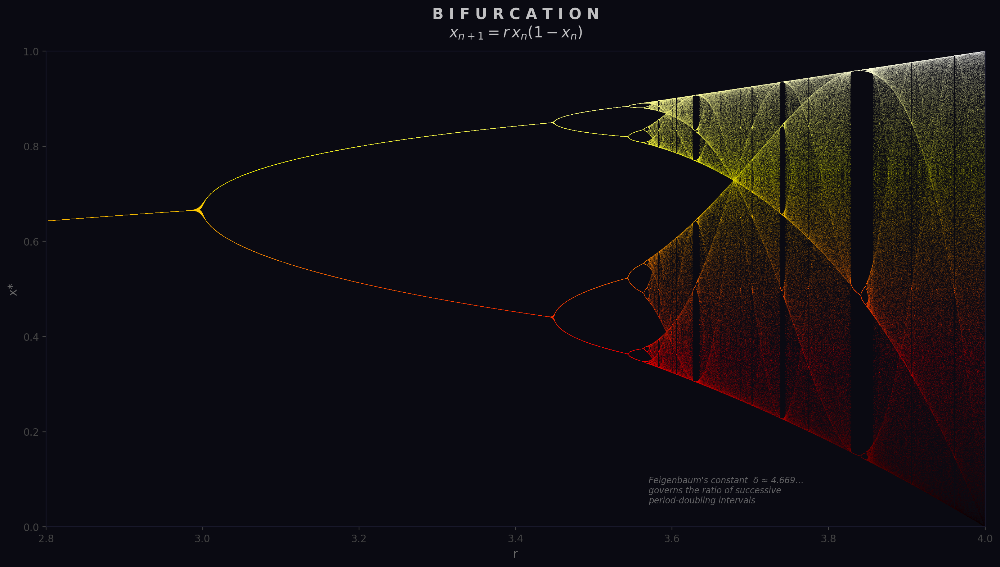
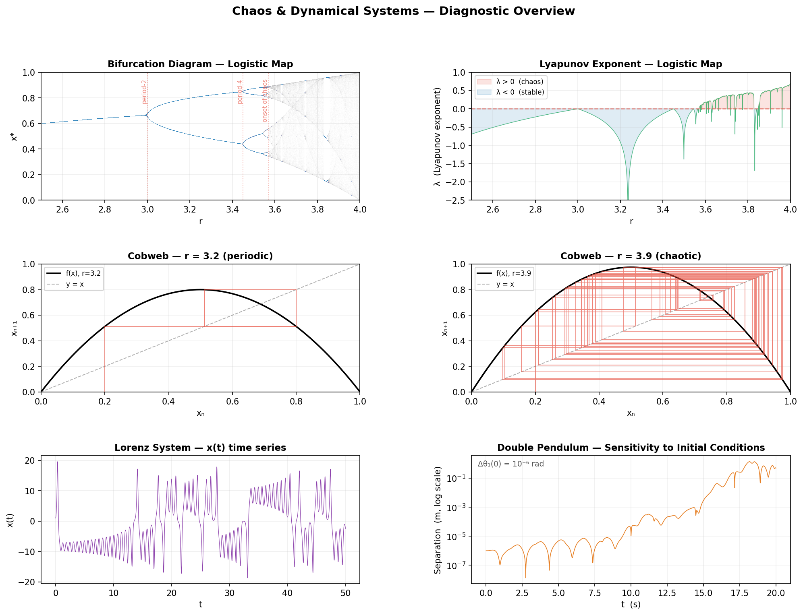
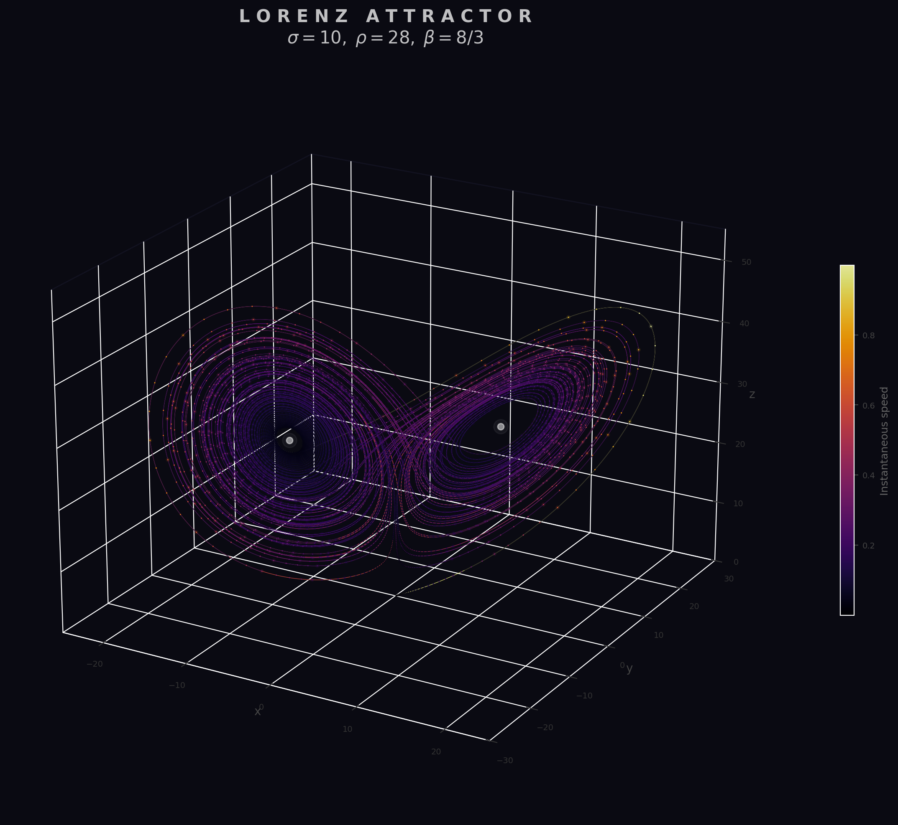
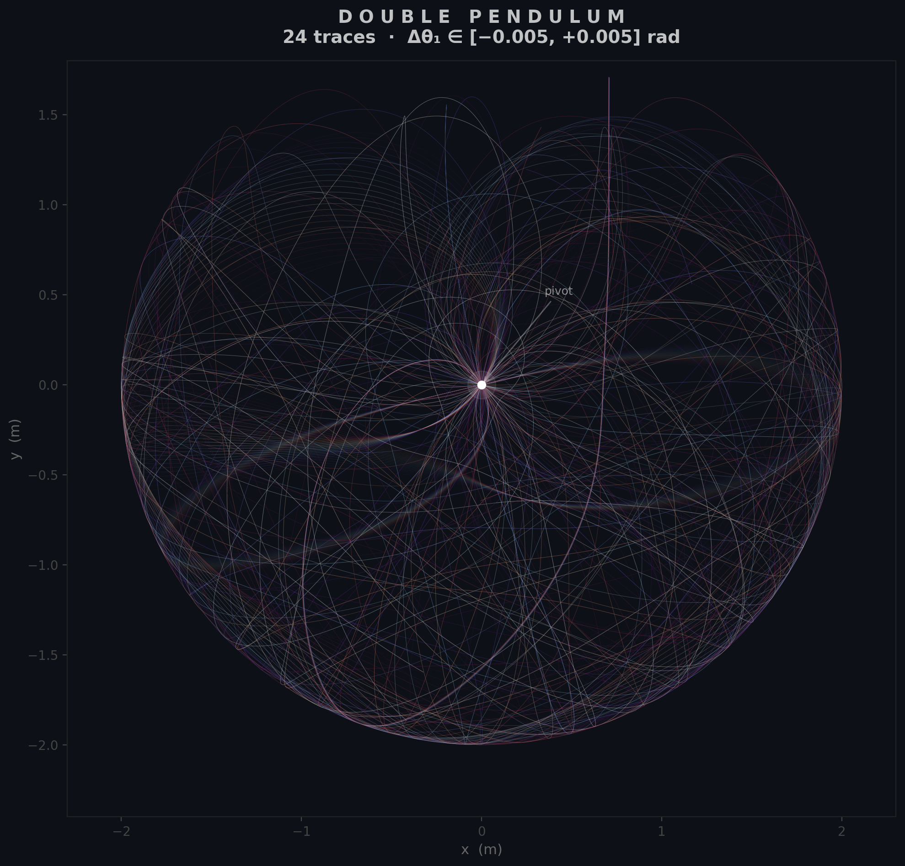

<h1 class="doc-title">Chaos &amp; Dynamical Systems</h1>

Python script: <code>chaos_dynamics.py</code>

A deterministic system is *chaotic* when its long-term behaviour depends sensitively on initial conditions: two trajectories starting arbitrarily close will diverge exponentially in time. Chaos does not require randomness or high dimensionality — it can emerge from the simplest nonlinear maps and low-order ODEs.

<h3 class="sub-heading" id="chaos-logistic">6.1 The Logistic Map</h3>

The logistic map is the simplest discrete dynamical system that exhibits the full transition from stable fixed points to periodic orbits to chaos. Starting from an initial value $x_0 \in (0,1)$, iterate:

$$x_{n+1} = r\,x_n(1 - x_n)$$

The parameter $r$ controls the dynamics. For $r < 1$ the population dies out. For $1 < r < 3$ the iterates converge to a stable fixed point $x^* = 1 - 1/r$. At $r = 3$ the fixed point loses stability and the system begins oscillating between two values — a *period-doubling bifurcation*. Further period doublings occur in rapid succession: period 4 near $r \approx 3.449$, period 8 near $r \approx 3.544$, and so on, accumulating at $r_\infty \approx 3.5699$ where the map becomes chaotic.

A *cobweb diagram* visualises iteration graphically: plot $f(x) = rx(1-x)$ together with the diagonal $y = x$, then trace a staircase from $(x_n, x_n)$ vertically to $(x_n, f(x_n))$ and horizontally to $(f(x_n), f(x_n))$. The staircase spirals inward toward a fixed point when the orbit is stable and bounces erratically when chaotic.

<h3 class="sub-heading" id="chaos-bifurcation">6.2 Bifurcation Diagram</h3>

The bifurcation diagram plots the long-term iterates of the logistic map (after discarding transients) against the parameter $r$. It reveals the period-doubling cascade at a glance: a single branch that splits into two at $r = 3$, four near $r \approx 3.449$, and so on until the branches merge into a dense chaotic band beyond $r_\infty$.

Feigenbaum discovered that the ratio of successive bifurcation intervals converges to a universal constant:

$$\delta = \lim_{n \to \infty} \frac{r_{n} - r_{n-1}}{r_{n+1} - r_n} \approx 4.669\,201\,609\ldots$$

This constant is *universal* — it appears in any unimodal map undergoing period doubling, not just the logistic map.

<figure>

<figcaption>
Figure 1.
<strong>Bifurcation diagram of the logistic map.</strong> Long-term iterates of $x_{n+1} = rx_n(1-x_n)$ plotted against $r$, showing the period-doubling route to chaos. Windows of periodic behaviour (e.g. the period-3 window near $r \approx 3.83$) punctuate the chaotic regime. $ python chaos_dynamics.py
</figcaption>
</figure>

<figure>

<figcaption>
Figure 2.
<strong>Diagnostic overview</strong> — bifurcation diagram, Lyapunov exponent vs $r$, cobweb diagrams at selected $r$ values, Lorenz attractor time series, and double pendulum trajectory divergence. $ python chaos_dynamics.py
</figcaption>
</figure>

<h3 class="sub-heading" id="chaos-lyapunov">6.3 Lyapunov Exponents</h3>

The Lyapunov exponent quantifies the average rate at which nearby orbits diverge (or converge). For a one-dimensional map $x_{n+1} = f(x_n)$ it is defined as:

$$\lambda = \lim_{N \to \infty} \frac{1}{N} \sum_{n=0}^{N-1} \ln\!\left|f'(x_n)\right|$$

When $\lambda < 0$ perturbations shrink and the orbit is stable; when $\lambda > 0$ nearby trajectories separate exponentially and the system is chaotic. The boundary $\lambda = 0$ corresponds to marginal stability (bifurcation points). For the logistic map with $r > r_\infty$ the exponent is positive almost everywhere, confirming chaos — though it dips negative inside periodic windows.

For higher-dimensional systems there is one Lyapunov exponent per dimension; chaos requires at least one positive exponent. The Lorenz system, for example, has one positive, one zero (along the flow), and one negative exponent.

<h3 class="sub-heading" id="chaos-lorenz">6.4 Lorenz Attractor</h3>

In 1963 Edward Lorenz discovered that a drastically simplified model of atmospheric convection exhibits sensitive dependence on initial conditions. The system is defined by three coupled ODEs:

$$\dot{x} = \sigma(y - x), \qquad \dot{y} = x(\rho - z) - y, \qquad \dot{z} = xy - \beta z$$

With the classic parameters $\sigma = 10$, $\rho = 28$, $\beta = 8/3$, trajectories are attracted to a butterfly-shaped set of zero volume in phase space — a *strange attractor*. The attractor is fractal: it has a non-integer dimension of approximately 2.06. Trajectories never repeat and never escape, yet two solutions starting a tiny distance apart diverge exponentially while remaining bounded on the attractor.

<figure>

<figcaption>
Figure 3.
<strong>Lorenz attractor</strong> with $\sigma=10, \rho=28, \beta=8/3$. The trajectory winds around two lobes, switching unpredictably between them — the hallmark of deterministic chaos in a continuous system. $ python chaos_dynamics.py
</figcaption>
</figure>

<h3 class="sub-heading" id="chaos-pendulum">6.5 Double Pendulum</h3>

The double pendulum — two rigid rods connected end-to-end, swinging under gravity — is a canonical physical system that exhibits chaos. Its equations of motion are derived from the Lagrangian and involve coupled second-order nonlinear ODEs in the two angles $\theta_1$ and $\theta_2$.

At small amplitudes the motion is quasi-periodic and predictable. At larger amplitudes the system becomes chaotic: two pendulums released from initial angles differing by as little as $10^{-6}$ radians will follow nearly identical paths for a time, then abruptly diverge into completely different trajectories. This exponential sensitivity makes long-term prediction impossible despite the system being fully deterministic.

<figure>

<figcaption>
Figure 4.
<strong>Double pendulum.</strong> Trajectories of the lower mass traced over time. The intricate, non-repeating path illustrates the chaotic regime — small changes in initial conditions produce qualitatively different motion. $ python chaos_dynamics.py
</figcaption>
</figure>

  <a href="/shared/md.html?src=Mathematics/Numerical-Methods/FFT-Spectral/README.md">&larr; Prev: FFT &amp; Spectral</a>
  <a href="/shared/md.html?src=Mathematics/Numerical-Methods/Reaction-Diffusion/README.md">Next: Reaction-Diffusion &rarr;</a>

<h3 class="sub-heading" id="chaos-references">References</h3>

[1] E. N. Lorenz, J. Atmos. Sci. <strong>20</strong>, 130 (1963).

[2] R. M. May, Nature <strong>261</strong>, 459 (1976).

[3] M. J. Feigenbaum, J. Stat. Phys. <strong>19</strong>, 25 (1978).

[4] S. H. Strogatz, <em>Nonlinear Dynamics and Chaos</em>, 2nd ed. (Westview Press, Boulder, CO, 2015).

