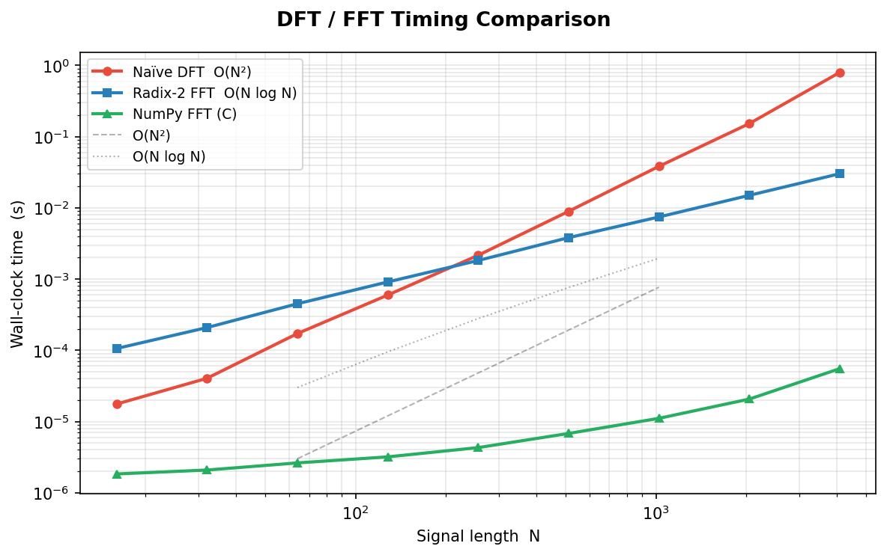
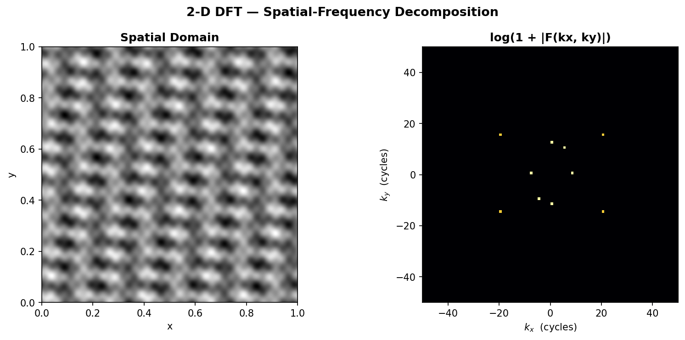
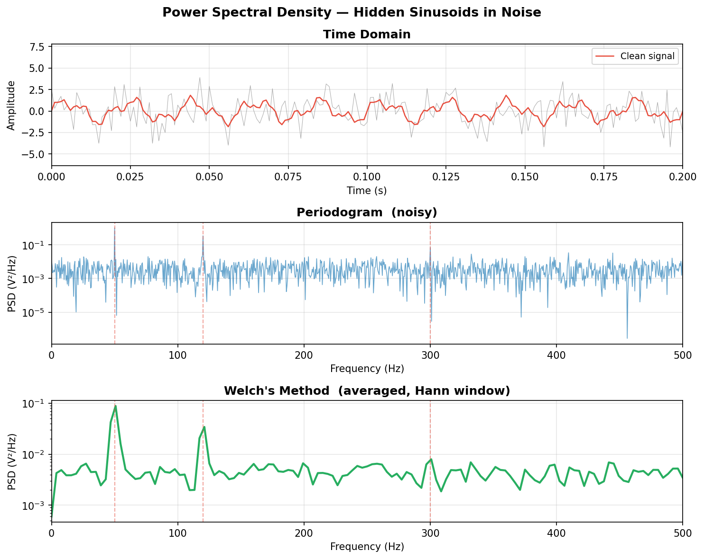
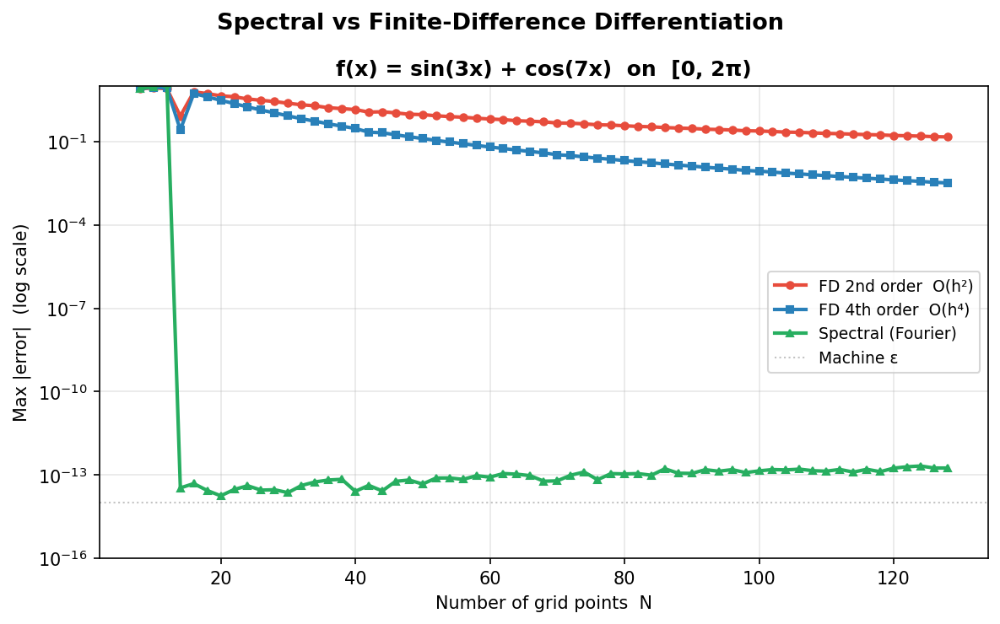
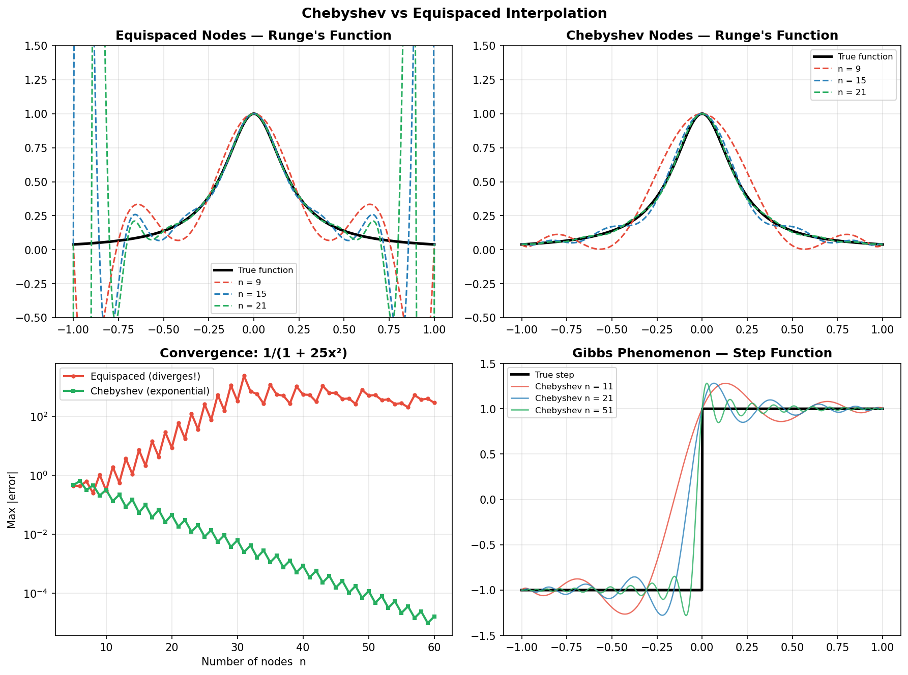
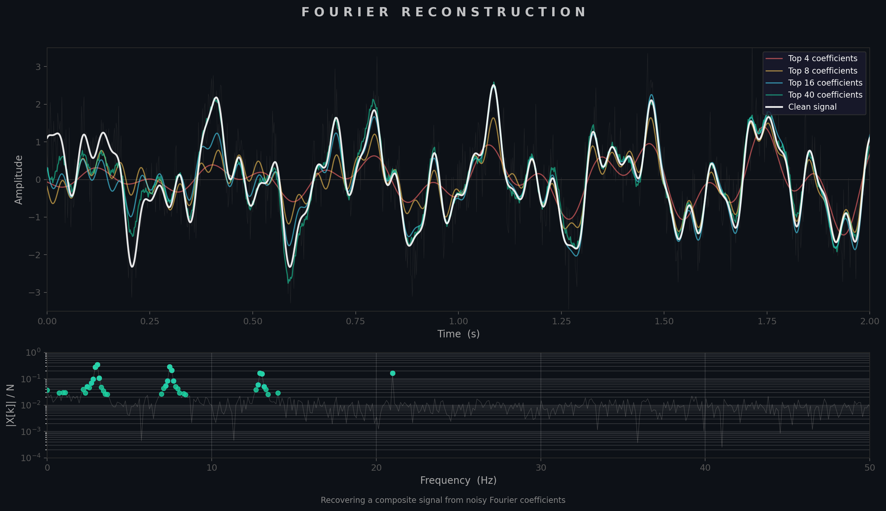

<h1 class="doc-title">FFT &amp; Spectral Methods</h1>

<div class="doc-meta"><span>Python script: <code>fft_spectral.py</code></span></div>

The Discrete Fourier Transform (DFT) and its fast algorithm (FFT) underpin an extraordinary range of numerical methods: signal processing, spectral analysis, fast convolution, PDE solvers, and more. This section develops the theory from the DFT definition through the Cooley-Tukey radix-2 FFT, extends it to two dimensions and power-spectrum estimation, and shows how Fourier and Chebyshev spectral methods achieve exponential convergence for smooth functions.

`$ python fft_spectral.py`

<h3 class="sub-heading" id="fft-dft">5.1 The DFT</h3>

Given $N$ samples $x_0, x_1, \ldots, x_{N-1}$, the forward DFT produces $N$ frequency coefficients:

$$X_k = \sum_{n=0}^{N-1} x_n \, e^{-i\,2\pi k n / N}, \qquad k = 0, 1, \ldots, N-1$$

and the inverse DFT recovers the original samples:

$$x_n = \frac{1}{N}\sum_{k=0}^{N-1} X_k \, e^{\,i\,2\pi k n / N}, \qquad n = 0, 1, \ldots, N-1$$

In matrix form the DFT is $\mathbf{X} = \mathbf{F}\,\mathbf{x}$, where $F_{kn} = \omega_N^{kn}$ with $\omega_N = e^{-i\,2\pi/N}$. The matrix $\mathbf{F}$ is symmetric and unitary (up to a factor of $\sqrt{N}$), so the inverse is simply $\mathbf{F}^{-1} = \frac{1}{N}\,\mathbf{F}^*$. Direct evaluation costs $O(N^2)$ operations.

<h3 class="sub-heading" id="fft-cooley-tukey">5.2 Cooley-Tukey FFT</h3>

The Cooley-Tukey algorithm exploits the periodicity and symmetry of $\omega_N$ to decompose an $N$-point DFT (where $N$ is a power of 2) into two $N/2$-point DFTs — one on the even-indexed samples and one on the odd-indexed samples:

$$X_k = E_k + \omega_N^k \, O_k, \qquad X_{k+N/2} = E_k - \omega_N^k \, O_k$$

where $E_k$ and $O_k$ are the DFTs of the even and odd subsequences respectively. Applying this decomposition recursively reduces the total cost from $O(N^2)$ to $O(N \log N)$ — one of the most consequential algorithmic improvements in scientific computing.

<figure>

<figcaption>Figure 1 &mdash; Wall-clock comparison of direct DFT ($O(N^2)$) and Cooley-Tukey FFT ($O(N\log N)$). The practical speedup exceeds $100\times$ even for modest $N$.</figcaption>
</figure>

<div class="box warning">
<strong>Warning:</strong> A recursive Python implementation of the FFT is useful for understanding the algorithm but should never be used in production. NumPy's <code>numpy.fft</code> and SciPy's <code>scipy.fft</code> call optimised C/Fortran libraries (e.g., pocketfft) and are orders of magnitude faster.
</div>

<h3 class="sub-heading" id="fft-2d">5.3 2-D DFT</h3>

The two-dimensional DFT of an $M \times N$ array $x_{m,n}$ is:

$$X_{k,l} = \sum_{m=0}^{M-1}\sum_{n=0}^{N-1} x_{m,n}\,e^{-i\,2\pi(km/M + ln/N)}$$

Because the 2-D DFT is **separable**, it can be computed as $N$ row-wise 1-D FFTs followed by $M$ column-wise 1-D FFTs (or vice versa), giving a total cost of $O(MN\log(MN))$. This separability extends to higher dimensions and is the basis for efficient image processing, 2-D convolution, and spectral PDE solvers on rectangular grids.

<figure>

<figcaption>Figure 2 &mdash; Original image and its 2-D magnitude spectrum $\log(1 + |X_{k,l}|)$. Low-frequency content concentrates near the centre; edges and textures produce high-frequency components along corresponding orientations.</figcaption>
</figure>

<h3 class="sub-heading" id="fft-psd">5.4 Power Spectrum</h3>

The **periodogram** estimates the power spectral density (PSD) from a single realisation:

$$\hat{S}(f_k) = \frac{1}{N}\,|X_k|^2$$

The raw periodogram is a noisy, inconsistent estimator. **Welch's method** improves it by splitting the signal into overlapping, windowed segments, computing a periodogram for each, and averaging. Common window functions (Hann, Hamming, Blackman) reduce spectral leakage by tapering the segment edges toward zero, trading frequency resolution for lower sidelobe levels.

<figure>

<figcaption>Figure 3 &mdash; Power spectrum of a noisy multi-tone signal estimated via the raw periodogram and Welch's method. Averaging and windowing dramatically reduce the noise floor.</figcaption>
</figure>

<h3 class="sub-heading" id="fft-spectral-diff">5.5 Spectral Differentiation</h3>

For a periodic function sampled on a uniform grid, differentiation in Fourier space reduces to multiplication by $ik$:

$$\widehat{f'}(k) = ik\,\hat{f}(k)$$

The derivative is computed as: (1) FFT the samples, (2) multiply each coefficient by $ik$, (3) inverse FFT. For smooth, periodic functions this achieves **exponential convergence** — error decreases faster than any polynomial in $N$ — making spectral methods vastly more accurate than finite differences for the same grid resolution.

<figure>

<figcaption>Figure 4 &mdash; Error in the numerical derivative of $\sin(x)$ computed by spectral differentiation vs. second-order finite differences. The spectral method reaches machine precision with far fewer grid points.</figcaption>
</figure>

<div class="box warning">
<strong>Warning:</strong> Spectral differentiation via FFT assumes the function is periodic on the computational domain. Applying it to non-periodic data introduces Gibbs-like oscillations at the boundaries. For non-periodic problems, use Chebyshev spectral methods instead.
</div>

<h3 class="sub-heading" id="fft-chebyshev">5.6 Chebyshev Polynomials</h3>

Chebyshev spectral methods handle non-periodic functions on a finite interval $[-1,1]$ by expanding in Chebyshev polynomials $T_n(x) = \cos(n\,\arccos x)$. The optimal interpolation nodes are the Chebyshev-Gauss-Lobatto points:

$$x_j = \cos\!\left(\frac{\pi j}{N}\right), \qquad j = 0, 1, \ldots, N$$

These nodes cluster near the endpoints, suppressing Runge's phenomenon and ensuring near-optimal polynomial interpolation. For analytic functions the Chebyshev coefficients decay exponentially, giving **spectral convergence** even on non-periodic domains. The Gibbs phenomenon — persistent oscillations near discontinuities in truncated Fourier series — can be mitigated in the Chebyshev setting using filtering or Gegenbauer reconstruction.

<figure>

<figcaption>Figure 5 &mdash; Chebyshev interpolation of a smooth function on $[-1,1]$, showing the clustered node distribution and exponential coefficient decay.</figcaption>
</figure>

<figure>

<figcaption>Figure 6 &mdash; Artistic visualization of spectral basis functions and their superposition, illustrating how a small number of modes can accurately represent complex waveforms.</figcaption>
</figure>

<h3 class="sub-heading" id="fft-practice">5.7 In Practice</h3>

<div class="box">
<strong>Recommended library:</strong> <code>scipy.fft</code> &mdash; a modern, feature-complete FFT interface supporting real, complex, and multidimensional transforms with optional worker-thread parallelism. For real-valued data, use <code>rfft</code>/<code>irfft</code> to halve memory and computation.
</div>

```python
# FFT of a real-valued signal
from scipy.fft import rfft, irfft, rfftfreq
import numpy as np

N, dt = 1024, 1/1000
t = np.arange(N) * dt
x = np.sin(2*np.pi*50*t) + 0.5*np.sin(2*np.pi*120*t)

X = rfft(x)
freqs = rfftfreq(N, dt)
```

```python
# Welch's method for power spectrum estimation
from scipy.signal import welch

f, Pxx = welch(x, fs=1/dt, nperseg=256, noverlap=128, window='hann')
```

```python
# Spectral differentiation of a periodic function
k = np.fft.fftfreq(N, d=1/N) * 2j * np.pi   # wavenumbers * i
f_hat = np.fft.fft(f_values)
df_values = np.real(np.fft.ifft(k * f_hat))
```

<table class="cmp-table">
  <thead>
    <tr><th>Scenario</th><th>Recommended Approach</th></tr>
  </thead>
  <tbody>
    <tr><td>1-D FFT (real data)</td><td><code>scipy.fft.rfft</code> / <code>irfft</code></td></tr>
    <tr><td>2-D FFT (images)</td><td><code>scipy.fft.fft2</code> / <code>ifft2</code></td></tr>
    <tr><td>Power spectrum</td><td><code>scipy.signal.welch</code></td></tr>
    <tr><td>Spectral PDE solver (periodic)</td><td>FFT + $ik$ multiplication</td></tr>
    <tr><td>Non-periodic spectral method</td><td>Chebyshev (e.g., <code>chebpy</code>)</td></tr>
    <tr><td>Large-scale / GPU</td><td><code>cupy.fft</code> or <code>jax.numpy.fft</code></td></tr>
  </tbody>
</table>

<div class="topic-nav">
  <a href="/shared/md.html?src=Mathematics/Numerical-Methods/Numerical-Integration/README.md">&larr; Prev: Integration</a>
  <a href="/shared/md.html?src=Mathematics/Numerical-Methods/Chaos-Dynamics/README.md">Next: Chaos &amp; Dynamics &rarr;</a>
</div>
