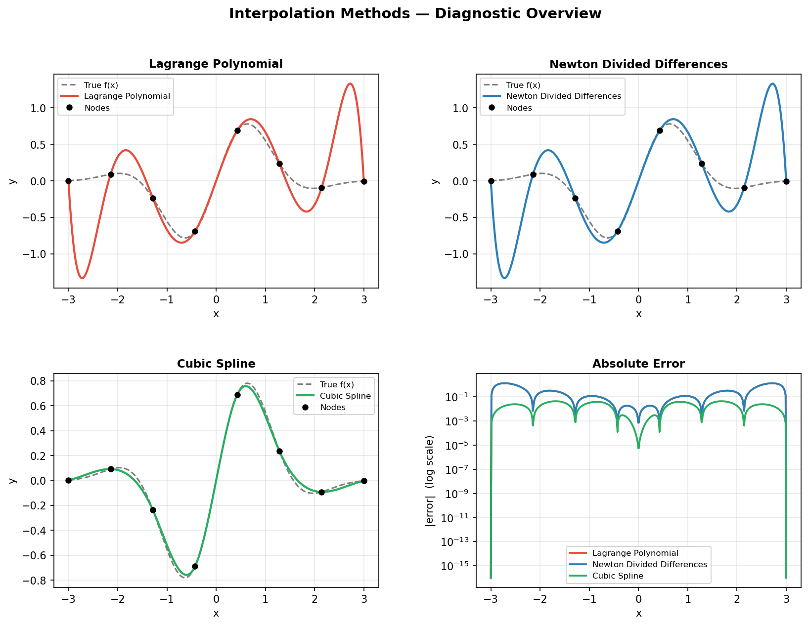
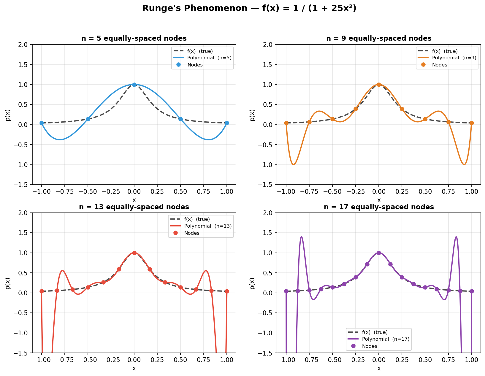
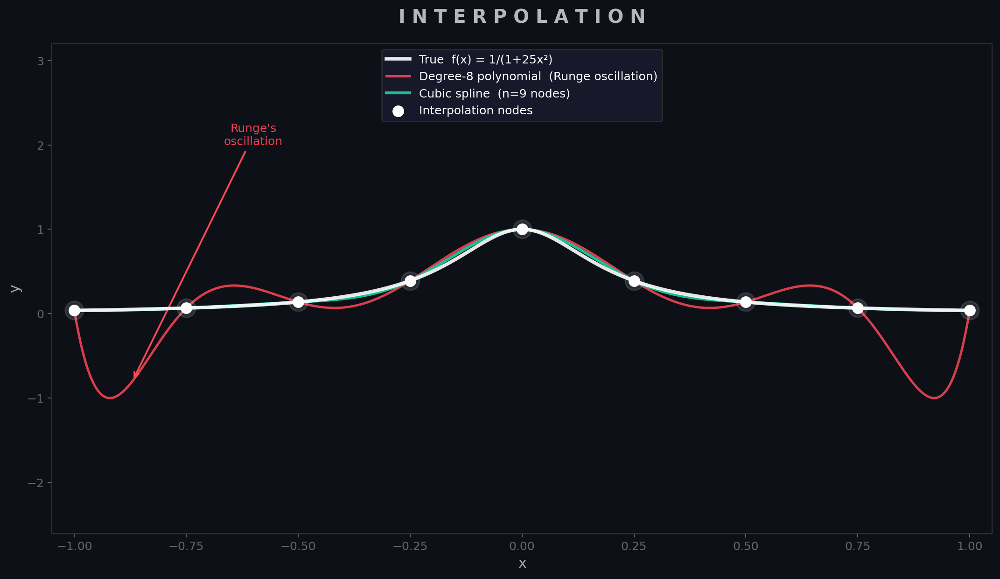

<h1 class="doc-title">Interpolation</h1>

<div class="doc-meta"><span>Python script: <code>interpolation.py</code></span></div>

Given a set of $n+1$ data points $(x_0, y_0), \ldots, (x_n, y_n)$, *interpolation* asks for a function $p(x)$ that passes exactly through every point. This arises constantly in practice: reconstructing a continuous signal from discrete sensor readings, evaluating a look-up table at an arbitrary query point, or building a smooth curve through experimentally measured data. The key design question is what *class* of function to use.

<h3 class="sub-heading" id="interp-lagrange">1.1 Lagrange Polynomial Interpolation</h3>

The most conceptually direct approach is to construct a single polynomial of degree $n$ that passes through all $n+1$ nodes. The Lagrange form achieves this by writing the interpolant as a linear combination of specially designed basis polynomials $L_i(x)$, each of which equals 1 at its own node and 0 at every other node:

<div class="box formula">

$$p(x) = \sum_{i=0}^{n} y_i \, L_i(x), \qquad L_i(x) = \prod_{\substack{j=0 \\ j \neq i}}^{n} \frac{x - x_j}{x_i - x_j}$$

</div>

This form is elegant but computationally expensive: evaluating $p(x)$ at a single point requires $O(n^2)$ multiplications, and adding a new data point forces a complete recomputation of all $n+1$ basis polynomials. For these reasons, Lagrange interpolation is mostly used as a theoretical tool rather than in production code.

<h3 class="sub-heading" id="interp-newton">1.2 Newton's Divided Differences</h3>

Newton's form represents the same polynomial more efficiently using a triangular table of *divided differences*:

<div class="box formula">

$$p(x) = [y_0] + [y_0, y_1](x - x_0) + [y_0, y_1, y_2](x - x_0)(x - x_1) + \cdots$$

</div>

where the divided-difference coefficients are computed recursively:

<div class="box formula">

$$[y_i, \ldots, y_{i+k}] = \frac{[y_{i+1},\ldots,y_{i+k}] - [y_i,\ldots,y_{i+k-1}]}{x_{i+k} - x_i}$$

</div>

The crucial practical advantage is *incrementality*: if a new data point $(x_{n+1}, y_{n+1})$ arrives, only one new column of the triangular table needs to be computed. Once the coefficient table is built in $O(n^2)$, evaluation at any $x$ via Horner's method costs only $O(n)$. Both the Lagrange and Newton forms produce *identical* polynomials — they are simply two representations of the unique degree-$n$ interpolant through $n+1$ points.

The figure below (produced by `interpolation.py`) demonstrates all three methods on the smooth test function $f(x) = \sin(2x)\,e^{-x^2/2}$ using 8 equally-spaced nodes, with a per-method absolute error panel in the lower right.

<figure>

<figcaption>
<span class="fig-num">Figure 1.</span>
<strong>Diagnostic overview of the three interpolation methods</strong> on $f(x) = \sin(2x)\,e^{-x^2/2}$ with 8 nodes. The lower-right panel shows absolute error on a log scale: Lagrange and Newton (identical polynomials, different representations) match the true function well across the interior, while the cubic spline achieves uniformly low error throughout. <span class="run-ref">$ python interpolation.py</span>
</figcaption>
</figure>

<h3 class="sub-heading" id="interp-runge">1.3 Runge's Phenomenon</h3>

A critical limitation of high-degree polynomial interpolation is *Runge's phenomenon*: even when the underlying function is perfectly smooth, the interpolating polynomial can develop large oscillations near the endpoints of the interval when nodes are equally spaced. The classic demonstration uses Runge's function:

<div class="box formula">

$$f(x) = \frac{1}{1 + 25x^2}, \qquad x \in [-1, 1]$$

</div>

This function is infinitely differentiable, yet the polynomial interpolant diverges as $n$ increases. The root cause is that the Lebesgue constant — which measures how much the interpolation scheme amplifies errors — grows exponentially with $n$ for equally-spaced nodes.

<div class="box warning">
<div class="box-title">Warning</div>
Never use high-degree polynomial interpolation with equally-spaced nodes on large datasets. The interpolant will oscillate wildly at the boundaries regardless of how smooth the underlying data is.
</div>

<figure>

<figcaption>
<span class="fig-num">Figure 2.</span>
<strong>Runge's phenomenon.</strong> Newton's divided-difference polynomial fitted to $f(x) = 1/(1+25x^2)$ using 5, 9, 13, and 17 equally-spaced nodes. As the degree increases, the polynomial matches the function well in the interior but develops catastrophic oscillations near $x = \pm 1$. The cubic spline avoids this entirely. <span class="run-ref">$ python interpolation.py</span>
</figcaption>
</figure>

Two remedies exist: (1) use Chebyshev nodes $x_k = \cos\!\left(\tfrac{(2k+1)\pi}{2(n+1)}\right)$, which cluster near the endpoints and suppress oscillation, achieving near-optimal polynomial interpolation for analytic functions; or (2) switch to piecewise interpolation.

<h3 class="sub-heading" id="interp-spline">1.4 Cubic Spline Interpolation</h3>

Rather than fitting a single polynomial of degree $n$, a cubic spline fits a separate cubic polynomial on each sub-interval $[x_i, x_{i+1}]$, then enforces that the pieces join *smoothly* — with matching values, first derivatives, and second derivatives at every interior node. This gives a piecewise function $S(x)$ that is globally $C^2$-smooth:

<div class="box formula">

$$S_i(x) = a_i + b_i(x - x_i) + c_i(x - x_i)^2 + d_i(x - x_i)^3, \quad x \in [x_i, x_{i+1}]$$

</div>

The smoothness conditions yield a tridiagonal linear system of size $(n-1) \times (n-1)$, which is solved in $O(n)$ by the Thomas algorithm. The *natural spline* boundary condition sets $S''(x_0) = S''(x_n) = 0$; other choices include *clamped* (prescribed endpoint slopes) and *not-a-knot* (used by MATLAB's `spline` function).

Cubic splines converge at $O(h^4)$ for smooth functions and are completely immune to Runge's phenomenon. They are the default choice for smooth interpolation in production code.

<figure>

<figcaption>
<span class="fig-num">Figure 3.</span>
<strong>Polynomial vs spline on Runge's function</strong> with 9 nodes. The red curve (degree-8 polynomial) exhibits pronounced edge oscillation; the teal curve (cubic spline, same nodes) tracks the true function almost perfectly. The annotation marks the region of maximum Runge oscillation near $x = -0.87$. <span class="run-ref">$ python interpolation.py</span>
</figcaption>
</figure>

<h3 class="sub-heading" id="interp-practice">1.5 Implementation &amp; When to Use</h3>

<div class="box inprac">
<div class="box-title">In Practice</div>
<strong>Use SciPy's <code>CubicSpline</code> for almost all interpolation tasks.</strong> It is robust, fast, and avoids every pitfall discussed above. Reach for polynomial interpolation only when you have very few points (&lt;6) or need the incremental update property of Newton's form.
</div>

<h4 class="minor-heading">Smooth continuous interpolation (the default case)</h4>

```python
from scipy.interpolate import CubicSpline
import numpy as np

x_nodes = np.linspace(0, 2 * np.pi, 8)
y_nodes = np.sin(x_nodes)

cs = CubicSpline(x_nodes, y_nodes)   # build once
x_query = np.linspace(0, 2 * np.pi, 500)
y_interp = cs(x_query)               # evaluate anywhere

# Derivatives are available directly
dy = cs(x_query, 1)   # first derivative
d2y = cs(x_query, 2)  # second derivative
```

<h4 class="minor-heading">Incremental updates (Newton's divided differences)</h4>

```python
# Use when data arrives sequentially and you need to add nodes cheaply.
# numpy.polynomial.polynomial is a cleaner interface for production use;
# the manual divided-difference table in interpolation.py shows the mechanics.
from numpy.polynomial.polynomial import Polynomial

# For most real tasks, scipy.interpolate.BarycentricInterpolator gives
# the same result as Lagrange/Newton with stable numerics:
from scipy.interpolate import BarycentricInterpolator
bi = BarycentricInterpolator(x_nodes, y_nodes)
print(bi([1.0, 1.5, 2.0]))   # query at multiple points
```

<h4 class="minor-heading">Choosing a method</h4>

<table class="cmp-table">
  <tr><th>Situation</th><th>Recommended method</th></tr>
  <tr><td>Smooth data, moderate $n$ (most cases)</td><td><code>scipy.interpolate.CubicSpline</code></td></tr>
  <tr><td>Very few points (&lt;6), one-off evaluation</td><td>Lagrange / <code>BarycentricInterpolator</code></td></tr>
  <tr><td>Data arriving incrementally</td><td>Newton divided differences</td></tr>
  <tr><td>High-accuracy, analytic function, arbitrary precision</td><td>Chebyshev nodes + polynomial</td></tr>
  <tr><td>Non-smooth / noisy data</td><td>Least-squares fit or <code>scipy.interpolate.UnivariateSpline</code></td></tr>
</table>

<div class="topic-nav">
  <span></span> <a href="/shared/md.html?src=Mathematics/Numerical-Methods/Root-Finding/README.md">Next: Root Finding &rarr;</a>
</div>
