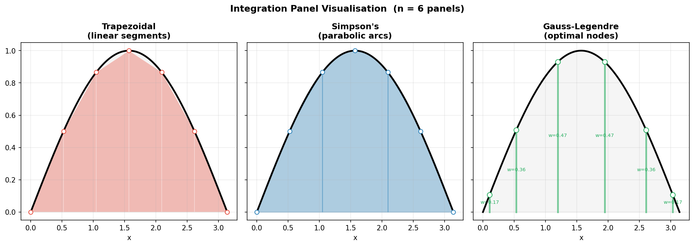
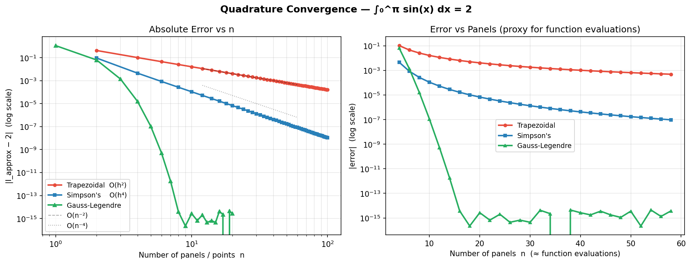
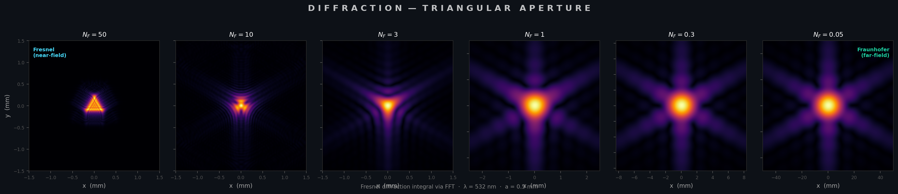

<h1 class="doc-title">Numerical Integration</h1>

<div class="doc-meta"><span>Python script: <code>quadrature.py</code></span></div>

Numerical quadrature approximates $I = \int_a^b f(x)\,dx$ when the antiderivative of $f$ is unavailable or impractical. All methods take the form of a weighted sum of function values: $I \approx \sum_{i=1}^n w_i\,f(x_i)$. The methods differ in how nodes $x_i$ and weights $w_i$ are chosen.

`$ python quadrature.py`

<h3 class="sub-heading" id="quad-trap">4.1 Composite Trapezoidal Rule</h3>

Divide $[a,b]$ into $n$ equal panels of width $h = (b-a)/n$ and approximate the integrand by a piecewise-linear function on each panel:

$$I_{\text{trap}} = \frac{h}{2}\Bigl[f(x_0) + 2\sum_{i=1}^{n-1} f(x_i) + f(x_n)\Bigr]$$

The error is $O(h^2)$ for general smooth functions. A remarkable bonus: for **periodic functions** integrated over a full period, the trapezoidal rule converges exponentially fast due to the Euler-Maclaurin formula — all error terms cancel when the derivatives at the endpoints match.

<h3 class="sub-heading" id="quad-simp">4.2 Simpson's 1/3 Rule</h3>

Fit a quadratic through each pair of adjacent panels ($n$ must be even):

$$I_{\text{Simp}} = \frac{h}{3}\Bigl[f(x_0) + 4\sum_{\text{odd}\,i} f(x_i) + 2\sum_{\text{even}\,i} f(x_i) + f(x_n)\Bigr]$$

The error is $O(h^4)$ — two orders better than the trapezoidal rule for the same number of function evaluations. Simpson's rule is exact for polynomials up to degree 3 (a bonus order from the symmetry of the quadratic fit).

<figure>

<figcaption>Figure 1 &mdash; Comparison of trapezoidal (piecewise-linear) and Simpson (piecewise-quadratic) panel approximations for a smooth integrand. The shaded regions show the area captured by each rule.</figcaption>
</figure>

<h3 class="sub-heading" id="quad-gauss">4.3 Gauss-Legendre Quadrature</h3>

Instead of equally-spaced nodes, Gauss-Legendre quadrature chooses nodes $\xi_i$ and weights $w_i$ on $[-1,1]$ to exactly integrate polynomials of degree up to $2n - 1$. The integral over an arbitrary interval $[a,b]$ is obtained by a linear change of variables:

$$\int_a^b f(x)\,dx = \frac{b-a}{2}\sum_{i=1}^{n} w_i\,f\!\left(\frac{b-a}{2}\,\xi_i + \frac{a+b}{2}\right)$$

With $n$ function evaluations, Gauss-Legendre achieves algebraic order $2n$, making it far more efficient than Newton-Cotes rules of comparable cost. The nodes are roots of the Legendre polynomial $P_n(\xi)$ and the weights are determined analytically.

<h3 class="sub-heading" id="quad-convergence">4.4 Convergence</h3>

The convergence behaviour of each rule is determined by the smoothness of the integrand and the distribution of nodes. For analytic (infinitely differentiable) functions, Gauss-Legendre quadrature converges exponentially in $n$, while Newton-Cotes rules converge polynomially. Integrands with singularities or discontinuities in derivatives can degrade the convergence order and require adaptive strategies.

<figure>

<figcaption>Figure 2 &mdash; Log-log convergence plot showing error vs. number of function evaluations for the trapezoidal rule, Simpson's rule, and Gauss-Legendre quadrature applied to a smooth test function.</figcaption>
</figure>

<figure>

<figcaption>Figure 3 &mdash; Fresnel diffraction pattern computed by numerical quadrature of the oscillatory Fresnel integral, demonstrating the practical application of adaptive quadrature to physics problems.</figcaption>
</figure>

<h3 class="sub-heading" id="quad-practice">4.5 In Practice</h3>

<div class="box">
<strong>Recommended library:</strong> <code>scipy.integrate.quad</code> &mdash; an adaptive Gauss-Kronrod integrator (QUADPACK) that automatically subdivides the interval and handles endpoint singularities. For multi-dimensional integrals, use <code>dblquad</code>, <code>tplquad</code>, or <code>nquad</code>.
</div>

```python
# Adaptive quadrature with error estimate
from scipy.integrate import quad
import numpy as np

result, error = quad(lambda x: np.exp(-x**2), 0, np.inf)
print(f"integral = {result:.12f}, est. error = {error:.2e}")
```

```python
# Fixed-order Gauss-Legendre quadrature
from numpy.polynomial.legendre import leggauss

nodes, weights = leggauss(20)           # 20-point rule on [-1, 1]
a, b = 0, np.pi
mapped = 0.5*(b - a)*nodes + 0.5*(a + b)
I = 0.5*(b - a) * np.dot(weights, np.sin(mapped))
```

<table class="cmp-table">
  <thead>
    <tr><th>Scenario</th><th>Recommended Method</th></tr>
  </thead>
  <tbody>
    <tr><td>General 1-D integral</td><td><code>scipy.integrate.quad</code></td></tr>
    <tr><td>Smooth integrand, fixed budget</td><td>Gauss-Legendre</td></tr>
    <tr><td>Periodic integrand over full period</td><td>Trapezoidal rule</td></tr>
    <tr><td>Tabulated data (equally spaced)</td><td>Simpson's rule / <code>scipy.integrate.simpson</code></td></tr>
    <tr><td>Multi-dimensional</td><td><code>nquad</code> or Monte Carlo</td></tr>
    <tr><td>Oscillatory integrals</td><td>Filon / Levin methods</td></tr>
  </tbody>
</table>

<div class="topic-nav">
  <a href="/shared/md.html?src=Mathematics/Numerical-Methods/ODE-Solvers/README.md">&larr; Prev: ODE Solvers</a>
  <a href="/shared/md.html?src=Mathematics/Numerical-Methods/FFT-Spectral/README.md">Next: FFT &amp; Spectral &rarr;</a>
</div>

<h3 class="sub-heading" id="quad-references">References</h3>

<div class="references">
<p>[1] P. J. Davis and P. Rabinowitz, <em>Methods of Numerical Integration</em>, 2nd ed. (Academic Press, New York, 1984).</p>
<p>[2] R. Piessens, E. de Doncker-Kapenga, C. W. Überhuber, and D. K. Kahaner, <em>QUADPACK: A Subroutine Package for Automatic Integration</em> (Springer, Berlin, 1983).</p>
<p>[3] G. H. Golub and J. H. Welsch, Math. Comput. <strong>23</strong>, 221 (1969).</p>
</div>
