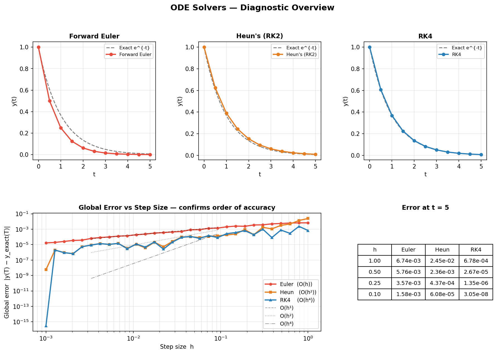
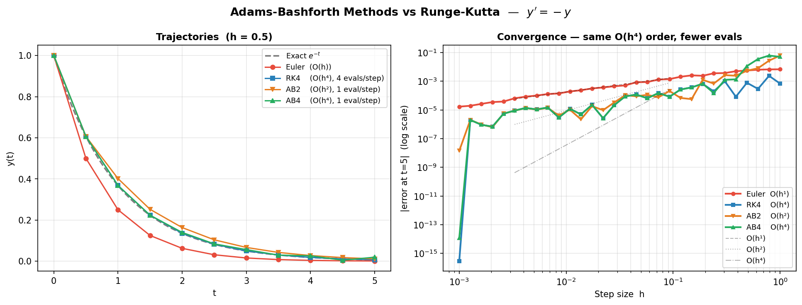
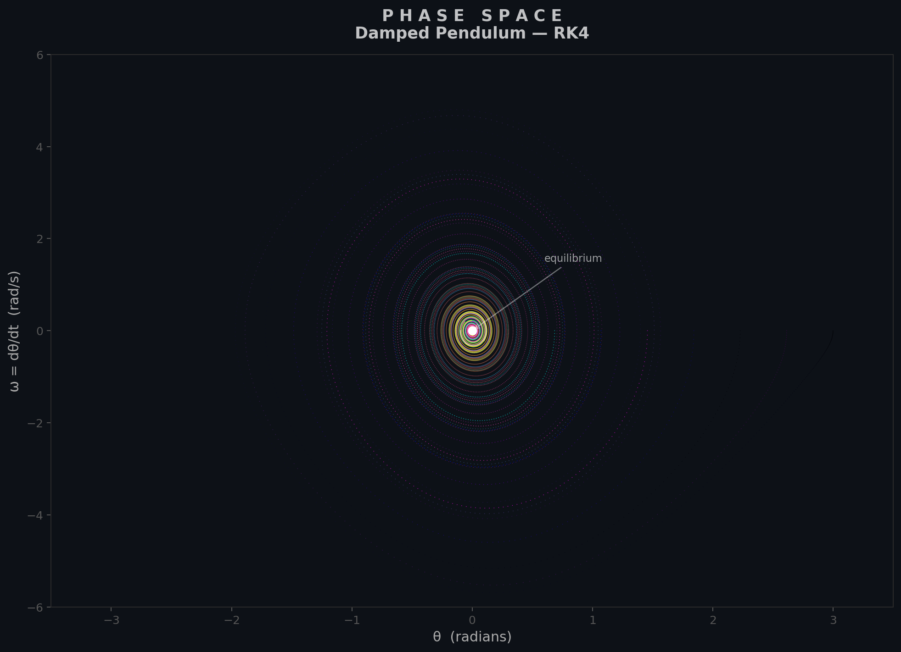

<h1 class="doc-title">ODE Solvers</h1>

<div class="doc-meta"><span>Python script: <code>ode_solvers.py</code></span></div>

An ordinary differential equation (ODE) initial value problem (IVP) takes the form $\mathbf{y}'(t) = \mathbf{f}(t, \mathbf{y})$, $\mathbf{y}(t_0) = \mathbf{y}_0$. Explicit time-stepping methods march forward from $t_0$, computing $\mathbf{y}_{n+1}$ from some combination of $f$ evaluated at past times. The central design trade-off is between accuracy per step (order of the method) and the number of function evaluations required.

`$ python ode_solvers.py`

<h3 class="sub-heading" id="ode-euler">3.1 Forward Euler</h3>

The simplest one-step method applies a single slope evaluation at the current point:

$$\mathbf{y}_{n+1} = \mathbf{y}_n + h\,\mathbf{f}(t_n, \mathbf{y}_n) \qquad [\text{order } 1]$$

The local truncation error is $O(h^2)$ per step, so the **global error** after $N = (T - t_0)/h$ steps accumulates to $O(h)$. Forward Euler is rarely used in production because halving the step size only halves the error, but it provides the conceptual foundation for all explicit methods and is useful for quick prototyping.

<h3 class="sub-heading" id="ode-rk2">3.2 Heun's Method (RK2)</h3>

Heun's method is a two-stage predictor-corrector scheme. First predict with an Euler step, then correct using the average of the slopes at both ends of the interval:

$$k_1 = \mathbf{f}(t_n,\, \mathbf{y}_n)$$
$$k_2 = \mathbf{f}(t_n + h,\, \mathbf{y}_n + h\,k_1)$$
$$\mathbf{y}_{n+1} = \mathbf{y}_n + \frac{h}{2}\bigl(k_1 + k_2\bigr) \qquad [\text{order } 2]$$

The local error drops to $O(h^3)$ and the global error to $O(h^2)$. Two function evaluations per step buy an extra order of accuracy compared with Euler, making Heun's method a good pedagogical stepping stone toward higher-order Runge-Kutta schemes.

<h3 class="sub-heading" id="ode-rk4">3.3 Classic RK4</h3>

The workhorse of fixed-step ODE solvers uses four slope evaluations per step:

$$k_1 = \mathbf{f}(t_n,\, \mathbf{y}_n)$$
$$k_2 = \mathbf{f}\!\left(t_n + \tfrac{h}{2},\, \mathbf{y}_n + \tfrac{h}{2}\,k_1\right)$$
$$k_3 = \mathbf{f}\!\left(t_n + \tfrac{h}{2},\, \mathbf{y}_n + \tfrac{h}{2}\,k_2\right)$$
$$k_4 = \mathbf{f}(t_n + h,\, \mathbf{y}_n + h\,k_3)$$
$$\mathbf{y}_{n+1} = \mathbf{y}_n + \frac{h}{6}\bigl(k_1 + 2k_2 + 2k_3 + k_4\bigr) \qquad [\text{order } 4]$$

The global error is $O(h^4)$: halving $h$ reduces the error by a factor of 16. RK4 remains the default choice when a simple, reliable, fixed-step integrator is needed.

<figure>

<figcaption>Figure 1 &mdash; Log-log plot of global error vs. step size for the three single-step methods. The slopes 1, 2, and 4 confirm the theoretical convergence orders.</figcaption>
</figure>

<h3 class="sub-heading" id="ode-ab">3.4 Adams-Bashforth</h3>

Multi-step methods reuse previously computed function values instead of evaluating $f$ at intermediate stages. The two-step Adams-Bashforth (AB2) formula is:

$$\mathbf{y}_{n+1} = \mathbf{y}_n + \frac{h}{2}\bigl(3\,\mathbf{f}_n - \mathbf{f}_{n-1}\bigr) \qquad [\text{order } 2]$$

The four-step variant (AB4) achieves order 4 with a single new function evaluation per step:

$$\mathbf{y}_{n+1} = \mathbf{y}_n + \frac{h}{24}\bigl(55\,\mathbf{f}_n - 59\,\mathbf{f}_{n-1} + 37\,\mathbf{f}_{n-2} - 9\,\mathbf{f}_{n-3}\bigr) \qquad [\text{order } 4]$$

AB methods need a starter (typically RK4 for the first few steps) and have smaller stability regions than single-step methods, but their cost per step is very low when $f$ is expensive to evaluate.

<figure>

<figcaption>Figure 2 &mdash; Error convergence for AB2 and AB4 multi-step methods compared with RK4, demonstrating the efficiency trade-off between function evaluations per step and overall accuracy.</figcaption>
</figure>

<h3 class="sub-heading" id="ode-phase">3.5 Phase Space</h3>

A second-order ODE such as the damped pendulum $\ddot{\theta} + b\,\dot{\theta} + \sin\theta = 0$ is converted to a first-order system by introducing $\omega = \dot{\theta}$:

$$\frac{d}{dt}\begin{pmatrix}\theta \\ \omega\end{pmatrix} = \begin{pmatrix}\omega \\ -b\,\omega - \sin\theta\end{pmatrix}$$

Plotting $\omega$ against $\theta$ produces the **phase portrait**. Trajectories spiral inward for $b > 0$ (damped), form closed orbits for $b = 0$ (conservative), and reveal separatrices between qualitatively different motions.

<figure>

<figcaption>Figure 3 &mdash; Phase portrait of the damped pendulum for several initial conditions. Trajectories spiral toward the stable equilibrium at the origin.</figcaption>
</figure>

<h3 class="sub-heading" id="ode-practice">3.6 In Practice</h3>

<div class="box">
<strong>Recommended library:</strong> <code>scipy.integrate.solve_ivp</code> &mdash; a unified interface to adaptive Runge-Kutta, multi-step, and implicit solvers with automatic step-size control and dense output.
</div>

```python
# Standard non-stiff IVP (e.g. orbital mechanics)
from scipy.integrate import solve_ivp

def f(t, y):
    return [y[1], -y[0]]          # simple harmonic oscillator

sol = solve_ivp(f, [0, 20], [1, 0], method='RK45',
                rtol=1e-8, atol=1e-10, dense_output=True)
```

```python
# Stiff system (e.g. chemical kinetics)
sol_stiff = solve_ivp(f_stiff, t_span, y0, method='BDF',
                      jac=jacobian, rtol=1e-6, atol=1e-8)
```

<table class="cmp-table">
  <thead>
    <tr><th>Scenario</th><th>Recommended Method</th></tr>
  </thead>
  <tbody>
    <tr><td>General non-stiff IVP</td><td>RK45 (Dormand-Prince)</td></tr>
    <tr><td>High accuracy</td><td>DOP853</td></tr>
    <tr><td>Expensive $f$</td><td>AB4 (multi-step)</td></tr>
    <tr><td>Stiff systems</td><td>LSODA / BDF</td></tr>
    <tr><td>Symplectic (Hamiltonian)</td><td>Verlet / Leapfrog</td></tr>
    <tr><td>Educational</td><td>Hand-coded RK4 / AB4</td></tr>
  </tbody>
</table>

<div class="topic-nav">
  <a href="/shared/md.html?src=Mathematics/Numerical-Methods/Root-Finding/README.md">&larr; Prev: Root Finding</a>
  <a href="/shared/md.html?src=Mathematics/Numerical-Methods/Numerical-Integration/README.md">Next: Integration &rarr;</a>
</div>
