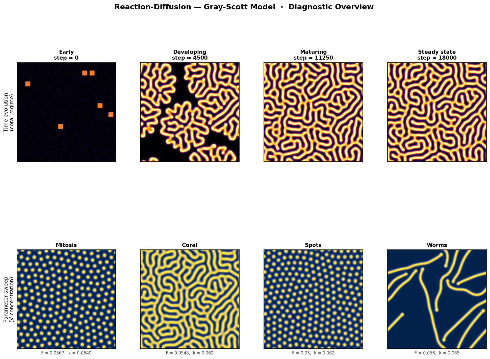
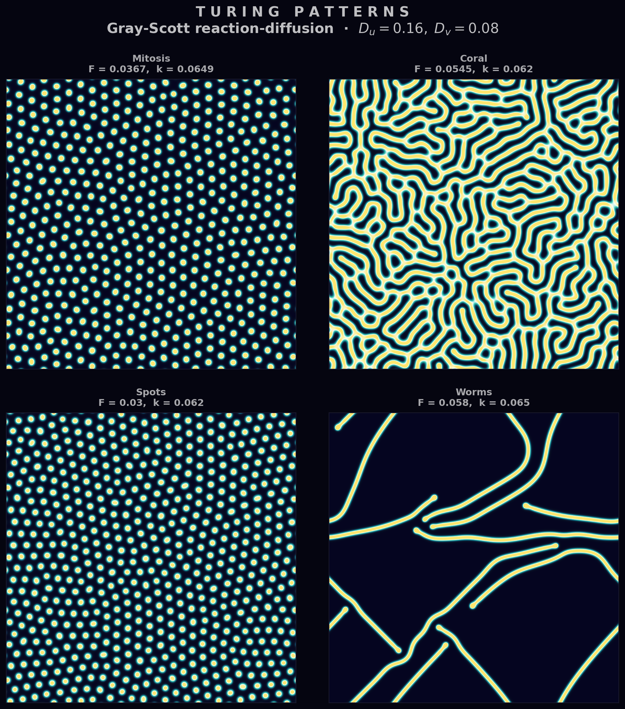

<h1 class="doc-title">Reaction-Diffusion</h1>

Python script: <code>reaction_diffusion.py</code>

Reaction-diffusion systems couple local chemical reactions with spatial diffusion to produce remarkably complex patterns from simple rules. They are among the most visually striking examples of self-organisation in mathematics and nature.

<h3 class="sub-heading" id="rd-turing">7.1 Turing Patterns</h3>

In a landmark 1952 paper, Alan Turing showed that a spatially uniform steady state can become unstable when two interacting chemicals diffuse at different rates. The faster-diffusing species (the *inhibitor*) suppresses the slower one (the *activator*) at long range, while the activator reinforces itself locally. This interplay — *local activation, long-range inhibition* — drives spontaneous symmetry breaking, producing stable spatial patterns from near-homogeneous initial conditions.

The resulting structures — spots, stripes, and labyrinths — appear throughout biology: the pigmentation of zebra fish and sea shells, the spacing of hair follicles, and the patterning of leopard rosettes. They also arise in purely chemical systems such as the Belousov-Zhabotinsky reaction.

<h3 class="sub-heading" id="rd-gray-scott">7.2 The Gray-Scott Model</h3>

The Gray-Scott model tracks two chemical species: a substrate $U$ that is continuously fed into the system and an activator $V$ that catalyses its own production by consuming $U$. The PDEs are:

$$\frac{\partial U}{\partial t} = D_u \nabla^2 U - UV^2 + F(1 - U)$$
$$\frac{\partial V}{\partial t} = D_v \nabla^2 V + UV^2 - (F + k)V$$

Here $F$ is the feed rate (replenishing $U$ and diluting $V$) and $k$ is the kill rate (removing $V$). The autocatalytic term $UV^2$ couples the two species: $V$ grows by consuming $U$, and two molecules of $V$ are required to convert one molecule of $U$.

The key requirement for pattern formation is $D_u > D_v$ — the substrate must diffuse faster than the activator. Typical values are $D_u = 0.16$ and $D_v = 0.08$ (a 2:1 ratio). The pair $(F, k)$ then selects which type of pattern emerges.

<h3 class="sub-heading" id="rd-numerics">7.3 Numerical Method</h3>

The Laplacian $\nabla^2$ is discretised on a uniform 2D grid using the standard 5-point stencil:

$$\nabla^2 u_{i,j} \approx \frac{u_{i+1,j} + u_{i-1,j} + u_{i,j+1} + u_{i,j-1} - 4\,u_{i,j}}{h^2}$$

Periodic boundary conditions wrap the grid into a torus, eliminating edge effects. Time integration uses forward Euler: at each step the reaction and diffusion terms are evaluated explicitly and added to the current concentrations. This is simple to implement but imposes a stability constraint $\Delta t \lesssim h^2 / (4\,D_u)$ — the CFL-like condition for diffusion on a 2D grid.

In practice the simulation runs on a grid of $256 \times 256$ or larger, with $h = 1$ and $\Delta t = 1$, for $O(10^4)$ time steps until patterns stabilise.

<figure>

<figcaption>
Figure 1.
<strong>Time evolution and parameter sweep.</strong> Upper row: snapshots of the $V$ concentration field at successive time steps showing pattern emergence from a small initial perturbation. Lower row: final patterns across different $(F, k)$ values. $ python reaction_diffusion.py
</figcaption>
</figure>

<h3 class="sub-heading" id="rd-regimes">7.4 Pattern Regimes</h3>

The $(F, k)$ parameter space contains a rich zoo of qualitatively different patterns. Four classic regimes:

<table class="cmp-table">
  <tr><th>Regime</th><th>$(F, k)$</th><th>Description</th></tr>
  <tr><td>Mitosis (self-replicating spots)</td><td>$(0.0367,\; 0.0649)$</td><td>Spots that grow, elongate, and divide — resembling cell division.</td></tr>
  <tr><td>Coral / labyrinthine</td><td>$(0.0545,\; 0.062)$</td><td>Branching, maze-like structures reminiscent of brain coral.</td></tr>
  <tr><td>Soliton spots</td><td>$(0.03,\; 0.062)$</td><td>Isolated, stable spots that neither grow nor shrink.</td></tr>
  <tr><td>Worms / stripes</td><td>$(0.058,\; 0.065)$</td><td>Elongated filaments that connect into stripe-like networks.</td></tr>
</table>

Transitions between regimes are often sharp: a small change in $F$ or $k$ can switch the system from spots to stripes or from stable patterns to extinction.

<figure>

<figcaption>
Figure 2.
<strong>Turing pattern mosaic.</strong> Final $V$ concentration fields for a grid of $(F, k)$ values, illustrating the diversity of self-organised structures accessible to the Gray-Scott model. $ python reaction_diffusion.py
</figcaption>
</figure>

<figure>

<figcaption>
Figure 3.
<strong>Reaction fronts.</strong> Gradient magnitude $|\nabla V|$ of a labyrinthine pattern, highlighting the sharp reaction fronts where $V$ transitions between high and low concentration. $ python reaction_diffusion.py
</figcaption>
</figure>

  <a href="/shared/md.html?src=Mathematics/Numerical-Methods/Chaos-Dynamics/README.md">&larr; Prev: Chaos &amp; Dynamics</a>
  

<h3 class="sub-heading" id="rd-references">References</h3>

[1] A. M. Turing, Philos. Trans. R. Soc. London B <strong>237</strong>, 37 (1952).

[2] P. Gray and S. K. Scott, Chem. Eng. Sci. <strong>38</strong>, 29 (1983).

[3] J. E. Pearson, Science <strong>261</strong>, 189 (1993).

[4] J. D. Murray, <em>Mathematical Biology II: Spatial Models and Biomedical Applications</em>, 3rd ed. (Springer, New York, 2003).

