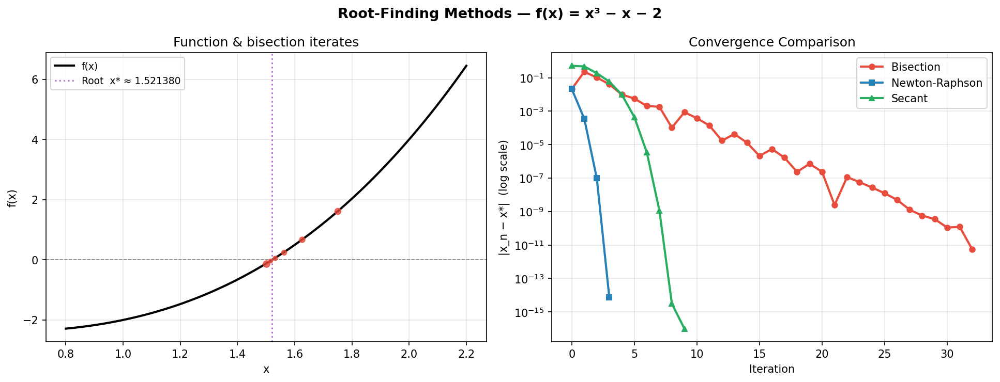
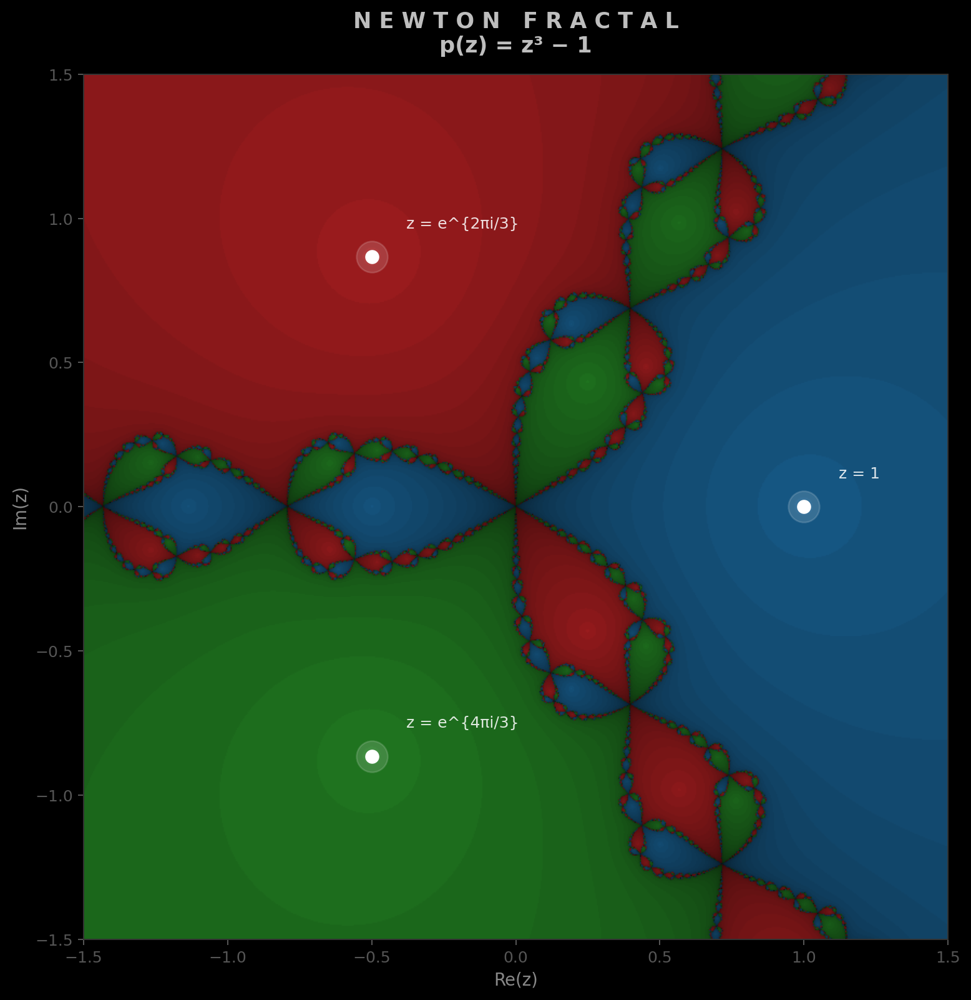

<h1 class="doc-title">Root Finding</h1>

<div class="doc-meta"><span>Python script: <code>root_finding.py</code></span></div>

A root-finding problem asks for a value $x^*$ satisfying $f(x^*) = 0$. This arises whenever a model equation cannot be solved analytically: equilibrium conditions in physics, implicit constitutive relations in materials science, pricing equations in finance. We study three iterative methods that make successively stronger assumptions in exchange for faster convergence.

<h3 class="sub-heading" id="root-bisection">2.1 Bisection Method</h3>

Bisection is the simplest bracketing method. Starting from an interval $[a, b]$ where $f(a)$ and $f(b)$ have opposite signs (guaranteeing a root exists by the Intermediate Value Theorem), it iteratively halves the bracket:

<div class="box formula">

$$m = \frac{a + b}{2}, \qquad \text{then replace } a \text{ or } b \text{ by } m \text{ to maintain sign change.}$$
$$\text{Error after } n \text{ steps:}\quad |e_n| \leq \frac{b - a}{2^n}$$

</div>

Bisection always converges. It requires exactly $\lceil\log_2((b-a)/\varepsilon)\rceil$ iterations to achieve absolute error $\varepsilon$ — for instance, 34 iterations to go from an interval of width 1 to machine precision. Its linear convergence makes it slow compared to Newton-Raphson for smooth functions, but it is the right tool when $f$ is not differentiable or when a guaranteed bracket is needed.

<h3 class="sub-heading" id="root-newton">2.2 Newton-Raphson Method</h3>

Newton-Raphson approximates the root by following the tangent line from the current point. Given $x_n$, the next iterate is the zero of the linear Taylor expansion of $f$ at $x_n$:

<div class="box formula">

$$x_{n+1} = x_n - \frac{f(x_n)}{f'(x_n)}$$

</div>

Near a simple root, Newton-Raphson converges *quadratically*: the number of correct decimal digits roughly doubles each iteration. Formally, if $|e_n| = |x_n - x^*|$, then $|e_{n+1}| \approx C |e_n|^2$ where $C = |f''(x^*)| / (2|f'(x^*)|)$. Starting from $x_0 \approx 1.5$ on $f(x) = x^3 - x - 2$, the method reaches machine precision in fewer than 8 iterations. The cost is that $f'$ must be computable, and the method can diverge for poor starting guesses or near inflection points.

<h3 class="sub-heading" id="root-secant">2.3 Secant Method</h3>

The secant method retains Newton's speed without requiring an analytic derivative by approximating $f'(x_n)$ with a finite-difference quotient using the previous two iterates:

<div class="box formula">

$$x_{n+1} = x_n - f(x_n)\,\frac{x_n - x_{n-1}}{f(x_n) - f(x_{n-1})}$$

</div>

Its convergence order is the golden ratio $\phi \approx 1.618$ — slower than Newton's quadratic rate but still superlinear, meaning the error shrinks faster than any geometric sequence. Each step costs exactly one function evaluation (compared to Newton's two: $f$ and $f'$), making it highly efficient when $f'$ is expensive or unavailable.

<figure>

<figcaption>
<span class="fig-num">Figure 1.</span>
<strong>Convergence comparison on $f(x) = x^3 - x - 2$</strong> (true root $x^* \approx 1.5214$). Left: the function with the first six bisection midpoints overlaid. Right: absolute error $|x_n - x^*|$ on a log scale. Bisection halves the error each step (linear, steady diagonal); Newton-Raphson's quadratic convergence is apparent from the accelerating drop after step 3; the secant method falls between them, needing two starting points but no derivative. <span class="run-ref">$ python root_finding.py</span>
</figcaption>
</figure>

<h3 class="sub-heading" id="root-fractal">2.4 The Newton Fractal — Basins of Attraction</h3>

Applied to a polynomial with multiple roots in the complex plane, Newton-Raphson partitions the complex plane into *basins of attraction* — regions from which a given root is reached. For $p(z) = z^3 - 1$, which has three cube roots of unity equally spaced on the unit circle, these basins have an intricate fractal boundary. The image below colours each point $z_0 \in \mathbb{C}$ by which root Newton's method converges to, with intensity encoding iteration count.

<figure>

<figcaption>
<span class="fig-num">Figure 2.</span>
<strong>Newton fractal for $p(z) = z^3 - 1$.</strong> Each pixel is a complex starting point $z_0$; colour indicates which of the three roots (marked with white circles) the iteration converges to. Darker shading indicates more iterations were needed. The fractal boundary between the basins is a Julia set — no matter how finely you zoom, the boundary remains infinitely intricate. Generated on an $800 \times 800$ grid. <span class="run-ref">$ python root_finding.py</span>
</figcaption>
</figure>

This illustrates why Newton-Raphson can be sensitive to initial conditions: starting points near the fractal boundaries can converge to any of the three roots unpredictably. In practice this motivates hybrid strategies — first bracket with bisection, then switch to Newton-Raphson for fast refinement.

<h3 class="sub-heading" id="root-practice">2.5 Implementation &amp; When to Use</h3>

<div class="box inprac">
<div class="box-title">In Practice</div>
For a general scalar equation with a known bracket, use <strong><code>scipy.optimize.brentq</code></strong> — it combines bisection and secant (and inverse quadratic interpolation) to get superlinear convergence with guaranteed robustness. For systems of equations, use <strong><code>scipy.optimize.fsolve</code></strong> or <strong><code>scipy.optimize.root</code></strong>.
</div>

<h4 class="minor-heading">Scalar root finding (most common case)</h4>

```python
from scipy.optimize import brentq, newton

f = lambda x: x**3 - x - 2

# Brent's method: robust bracketed solver (best general choice)
root = brentq(f, a=1.0, b=2.0, xtol=1e-12)
print(f"Root: {root:.10f}")   # 1.5213797068

# Newton-Raphson via scipy (supply derivative for speed)
df = lambda x: 3*x**2 - 1
root_nr = newton(f, x0=1.5, fprime=df)

# Secant method via scipy (no derivative)
root_sec = newton(f, x0=1.5)   # fprime=None uses secant
```

<h4 class="minor-heading">Systems of nonlinear equations</h4>

```python
from scipy.optimize import fsolve
import numpy as np

def system(vars):
    x, y = vars
    return [x**2 + y**2 - 1,     # x² + y² = 1
            y - x**2]             # y = x²

solution = fsolve(system, x0=[0.6, 0.4])
print(solution)   # [0.7862, 0.6180]
```

<h4 class="minor-heading">Choosing a method</h4>

<table class="cmp-table">
  <tr><th>Situation</th><th>Recommended method</th></tr>
  <tr><td>Known bracket, no derivative (most cases)</td><td><code>scipy.optimize.brentq</code></td></tr>
  <tr><td>Smooth $f$, derivative available, fast convergence needed</td><td>Newton-Raphson / <code>scipy.optimize.newton(fprime=df)</code></td></tr>
  <tr><td>Smooth $f$, derivative unavailable</td><td>Secant / <code>scipy.optimize.newton()</code></td></tr>
  <tr><td>System of equations</td><td><code>scipy.optimize.fsolve</code> or <code>.root</code></td></tr>
  <tr><td>Global search (multiple roots suspected)</td><td>Bisection scan + local refinement</td></tr>
</table>

<div class="topic-nav">
  <a href="/shared/md.html?src=Mathematics/Numerical-Methods/Interpolation/README.md">&larr; Prev: Interpolation</a>
  <a href="/shared/md.html?src=Mathematics/Numerical-Methods/ODE-Solvers/README.md">Next: ODE Solvers &rarr;</a>
</div>
