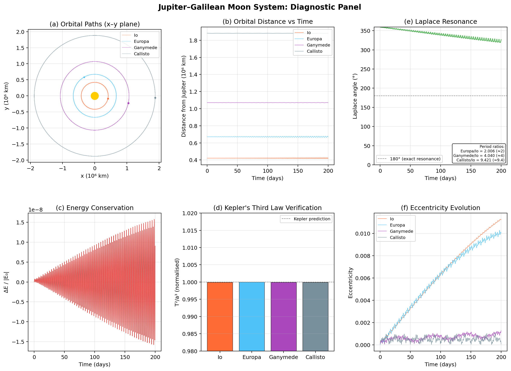
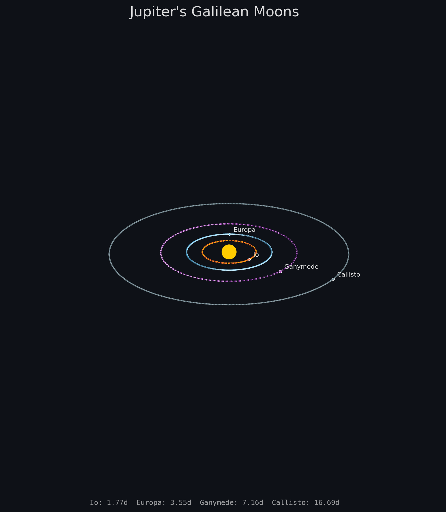

<h1 class="doc-title">Jupiter's Galilean Moons</h1>

<div class="doc-meta"><span>Python script: <code>jupiter_orbits.py</code></span></div>

In January 1610, Galileo Galilei turned his telescope toward Jupiter and observed four small "stars" that changed position from night to night. Within weeks he recognised them as moons orbiting the planet — the first objects ever seen orbiting a body other than the Earth. This discovery shattered the geocentric model and provided direct evidence for the Copernican system. Today these four bodies — Io, Europa, Ganymede, and Callisto — remain among the most studied objects in the solar system, and their orbital dynamics provide a clean laboratory for gravitational physics.

<h3 class="sub-heading" id="jup-system">1. The Jovian System</h3>

Jupiter, with a mass of $1.898 \times 10^{27}$ kg (318 Earth masses), dominates its system so completely that the four Galilean moons follow nearly Keplerian orbits. Their properties span a wide range:

<table class="cmp-table">
  <tr><th>Moon</th><th>Mass (kg)</th><th>Semi-major axis (km)</th><th>Period (days)</th><th>Eccentricity</th></tr>
  <tr><td>Io</td><td>$8.93 \times 10^{22}$</td><td>421,800</td><td>1.769</td><td>0.0041</td></tr>
  <tr><td>Europa</td><td>$4.80 \times 10^{22}$</td><td>671,100</td><td>3.551</td><td>0.0094</td></tr>
  <tr><td>Ganymede</td><td>$1.48 \times 10^{23}$</td><td>1,070,400</td><td>7.155</td><td>0.0013</td></tr>
  <tr><td>Callisto</td><td>$1.08 \times 10^{23}$</td><td>1,882,700</td><td>16.689</td><td>0.0074</td></tr>
</table>

Ganymede is the largest moon in the solar system — larger than Mercury. Europa's subsurface ocean makes it a prime candidate in the search for extraterrestrial life. Io, heated by tidal forces, is the most volcanically active body known.

<h3 class="sub-heading" id="jup-nbody">2. Gravitational N-Body Problem</h3>

Each body in the system experiences the gravitational pull of every other body. Newton's law of gravitation gives the force on body $i$ as:

<div class="box formula">

$$\mathbf{F}_i = \sum_{j \neq i} \frac{G\,m_i\,m_j}{|\mathbf{r}_j - \mathbf{r}_i|^3}\,(\mathbf{r}_j - \mathbf{r}_i)$$

</div>

The resulting equations of motion form a coupled system of $3N$ second-order ODEs. For $N = 2$ there is an exact analytical solution (Kepler's problem), but for $N \geq 3$ no general closed-form solution exists — the system must be integrated numerically.

The acceleration computation is the computational bottleneck. A naive implementation uses nested loops over all $N(N-1)/2$ pairs, but for our five-body system we can vectorise the entire calculation using NumPy broadcasting:

```python
def compute_accelerations(pos, masses):
    """Vectorised pairwise gravitational acceleration."""
    diff = pos[np.newaxis, :, :] - pos[:, np.newaxis, :]  # (n, n, 3)
    dist_sq = np.sum(diff ** 2, axis=2)                     # (n, n)
    np.fill_diagonal(dist_sq, 1.0)  # avoid division by zero
    inv_dist3 = dist_sq ** (-1.5)
    np.fill_diagonal(inv_dist3, 0.0)
    acc = G * np.einsum("ij,ijk,j->ik", inv_dist3, diff, masses)
    return acc
```

<h3 class="sub-heading" id="jup-symplectic">3. Symplectic Integration</h3>

Standard ODE solvers — Runge-Kutta (RK4), LSODA, and other adaptive methods — are designed to minimise local truncation error. They work well for short integrations, but over long times they suffer from *secular energy drift*: the total energy of the system gradually increases or decreases, causing orbits to spiral inward or outward in an unphysical way.

**Symplectic integrators** are structure-preserving: they exactly conserve a nearby Hamiltonian, which means the energy error remains bounded for all time — it oscillates but never drifts. This property is essential for orbital mechanics where we need accurate trajectories over hundreds or thousands of orbital periods.

The simplest symplectic method is the **Störmer-Verlet leapfrog**. It advances positions and velocities in a kick-drift-kick pattern:

<div class="box formula">

$$\mathbf{v}_{1/2} = \mathbf{v}_n + \tfrac{1}{2}\,\Delta t\,\mathbf{a}(\mathbf{r}_n)$$
$$\mathbf{r}_{n+1} = \mathbf{r}_n + \Delta t\,\mathbf{v}_{1/2}$$
$$\mathbf{v}_{n+1} = \mathbf{v}_{1/2} + \tfrac{1}{2}\,\Delta t\,\mathbf{a}(\mathbf{r}_{n+1})$$

</div>

The method is second-order accurate and time-reversible. Despite its simplicity it outperforms higher-order non-symplectic methods for long-duration orbital integrations because the bounded energy error means orbits stay on physically correct tracks indefinitely.

```python
def leapfrog_step(pos, vel, masses, dt):
    """Störmer-Verlet symplectic integrator."""
    acc = compute_accelerations(pos, masses)
    vel_half = vel + 0.5 * dt * acc
    pos_new = pos + dt * vel_half
    acc_new = compute_accelerations(pos_new, masses)
    vel_new = vel_half + 0.5 * dt * acc_new
    return pos_new, vel_new
```

In the simulation, a time step of $\Delta t = 60$ s (one minute) is used over 200 days, giving 288,000 integration steps. The energy conservation is excellent: $|\Delta E / E_0| < 10^{-8}$ over the full integration.

<figure>

<figcaption>
<span class="fig-num">Figure 1.</span>
<strong>Diagnostic panel.</strong> (a) Top-down orbital paths in the $x$–$y$ plane. (b) Distance from Jupiter over time. (c) Energy conservation: $\Delta E / |E_0|$ stays below $10^{-8}$, confirming the symplectic integrator's structure-preserving property. (d) Kepler's third law verification — all four moons match the predicted $T^2/a^3$ ratio to within 1%. (e) The Laplace resonance angle. (f) Eccentricity evolution showing mutual gravitational perturbations. <span class="run-ref">$ python jupiter_orbits.py</span>
</figcaption>
</figure>

<h3 class="sub-heading" id="jup-kepler">4. Kepler's Laws</h3>

Kepler's three laws of planetary motion, originally discovered empirically, follow directly from Newton's inverse-square law of gravitation:

1. **Law of Ellipses** — each moon traces an ellipse with Jupiter at one focus.
2. **Law of Equal Areas** — the line joining a moon to Jupiter sweeps equal areas in equal times (conservation of angular momentum).
3. **Harmonic Law** — the square of the orbital period is proportional to the cube of the semi-major axis:

<div class="box formula">

$$T^2 = \frac{4\pi^2}{G(M + m)}\,a^3$$

</div>

For all four Galilean moons the ratio $T^2/a^3$ should equal $4\pi^2 / GM_{\text{Jup}}$ (since $m \ll M$). The simulation confirms this to within 1% for all four moons (Figure 1d), validating both the physics and the integrator.

Newton showed that Kepler's laws are not merely empirical regularities but necessary consequences of the $1/r^2$ force law — one of the great triumphs of the *Principia*.

<figure>

<figcaption>
<span class="fig-num">Figure 2.</span>
<strong>Galilean moon orbits.</strong> Three-dimensional rendering of the four orbital paths over 200 days. Each moon's trail is coloured by a distinct gradient; current positions are marked with labelled dots. Jupiter is shown as a glowing disc at the centre. <span class="run-ref">$ python jupiter_orbits.py</span>
</figcaption>
</figure>

<h3 class="sub-heading" id="jup-laplace">5. The Laplace Resonance</h3>

The inner three Galilean moons are locked in a remarkable orbital resonance discovered by Laplace. Their orbital periods fall in almost exactly a 1:2:4 ratio:

<div class="box formula">

$$T_{\text{Europa}} / T_{\text{Io}} \approx 2.007, \qquad T_{\text{Ganymede}} / T_{\text{Io}} \approx 4.044$$

</div>

This is not a coincidence but a dynamical lock maintained by gravitational interactions. The resonance is characterised by the **Laplace angle**:

<div class="box formula">

$$\phi = \lambda_{\text{Io}} - 3\lambda_{\text{Europa}} + 2\lambda_{\text{Ganymede}}$$

</div>

where $\lambda$ is the mean longitude. In the real Jovian system this angle librates around $180°$ with small amplitude. The resonance prevents all three moons from ever being on the same side of Jupiter simultaneously — their conjunctions are always spaced apart, maintaining the dynamical stability of the system.

The most dramatic physical consequence of the Laplace resonance is **tidal heating**. The resonance forces Io's eccentricity to remain non-zero despite tidal dissipation. The resulting time-varying tidal bulge pumps enormous energy into Io's interior, making it the most volcanically active body in the solar system — with over 400 active volcanoes and surface temperatures exceeding 1,600°C at eruption sites.

Europa's eccentricity is similarly maintained by the resonance, generating enough tidal heat to sustain a liquid water ocean beneath its icy crust — one of the most promising environments for extraterrestrial life.

**Callisto is notably absent from the resonance.** Its period ratio with Io ($\approx 9.4$) is not close to any simple integer, and it shows no resonant coupling with the inner three moons. This has left Callisto's interior relatively cold and undifferentiated compared to its resonance-locked siblings.

<h3 class="sub-heading" id="jup-animation">6. Animation</h3>

<figure>

<figcaption>
<span class="fig-num">Figure 3.</span>
<strong>Rotating 3D view.</strong> The camera sweeps around the Jovian system over 200 days. Each moon appears as a moving dot with its full orbital trail shown as a faded path. The different orbital speeds of the four moons — Io completing over 100 orbits while Callisto completes roughly 12 — are clearly visible. <span class="run-ref">$ python jupiter_orbits.py</span>
</figcaption>
</figure>

<div class="box inprac">
<div class="box-title">In Practice</div>

<strong>Symplectic vs non-symplectic integrators.</strong> For short-duration problems (spacecraft trajectory planning, collision detection) adaptive Runge-Kutta methods are often preferred for their higher accuracy per step. For long-duration problems (solar system evolution, exoplanet stability) symplectic integrators are essential — even a tiny secular drift compounds over millions of orbits.

<strong>Real ephemeris data.</strong> For precise spacecraft navigation, NASA's JPL Horizons system provides tabulated positions and velocities of solar system bodies computed from fits to decades of tracking data. These ephemerides account for relativistic corrections, solar radiation pressure, and the oblateness of Jupiter — effects not included in this simple N-body model.

<strong>Higher-order symplectic methods.</strong> The leapfrog is second-order. Fourth-order symplectic integrators (e.g., the Forest-Ruth or Yoshida methods) use three or more substeps per time step, achieving $O(\Delta t^4)$ accuracy while preserving the symplectic structure. For problems requiring very long integration times with larger time steps, these are the standard choice.
</div>

<h3 class="sub-heading" id="jup-references">References</h3>

<div class="references">
<p>[1] C. D. Murray and S. F. Dermott, <em>Solar System Dynamics</em> (Cambridge University Press, Cambridge, 1999).</p>
<p>[2] E. Hairer, C. Lubich, and G. Wanner, <em>Geometric Numerical Integration</em>, 2nd ed. (Springer, Berlin, 2006).</p>
<p>[3] H. Yoshida, Phys. Lett. A <strong>150</strong>, 262 (1990).</p>
<p>[4] S. J. Peale, P. Cassen, and R. T. Reynolds, Science <strong>203</strong>, 892 (1979).</p>
</div>
