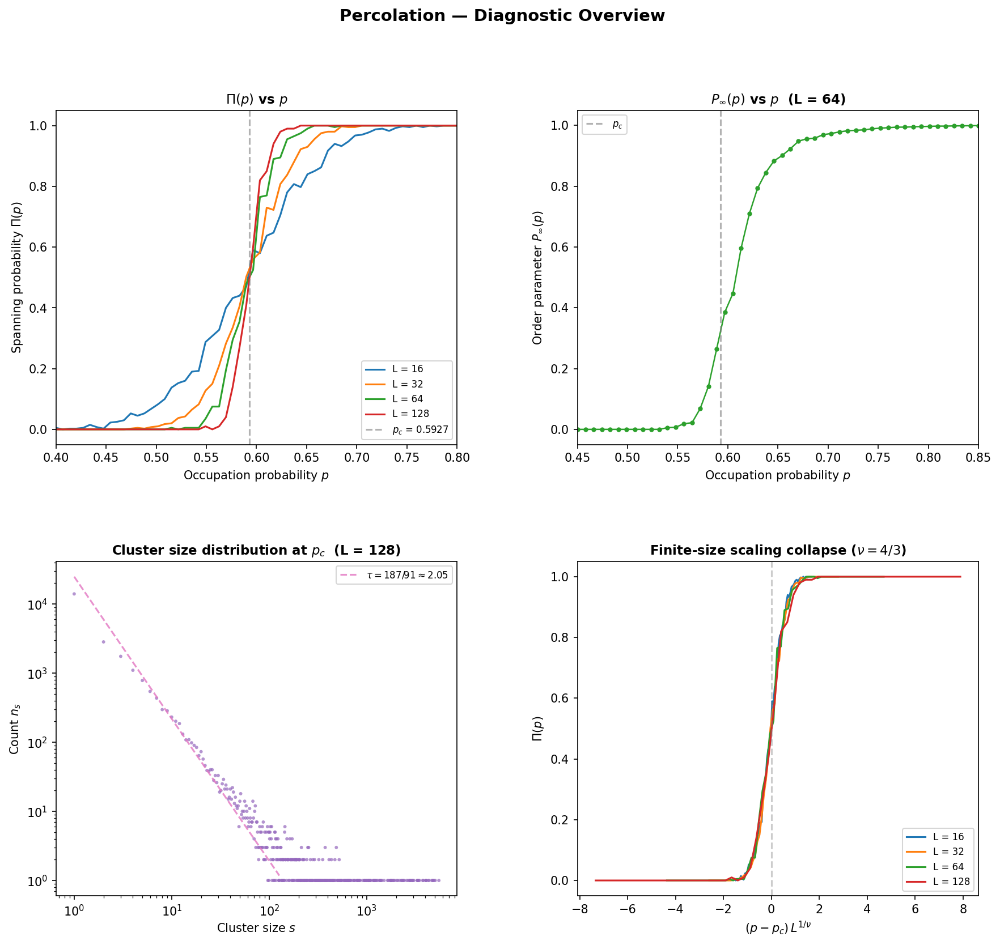
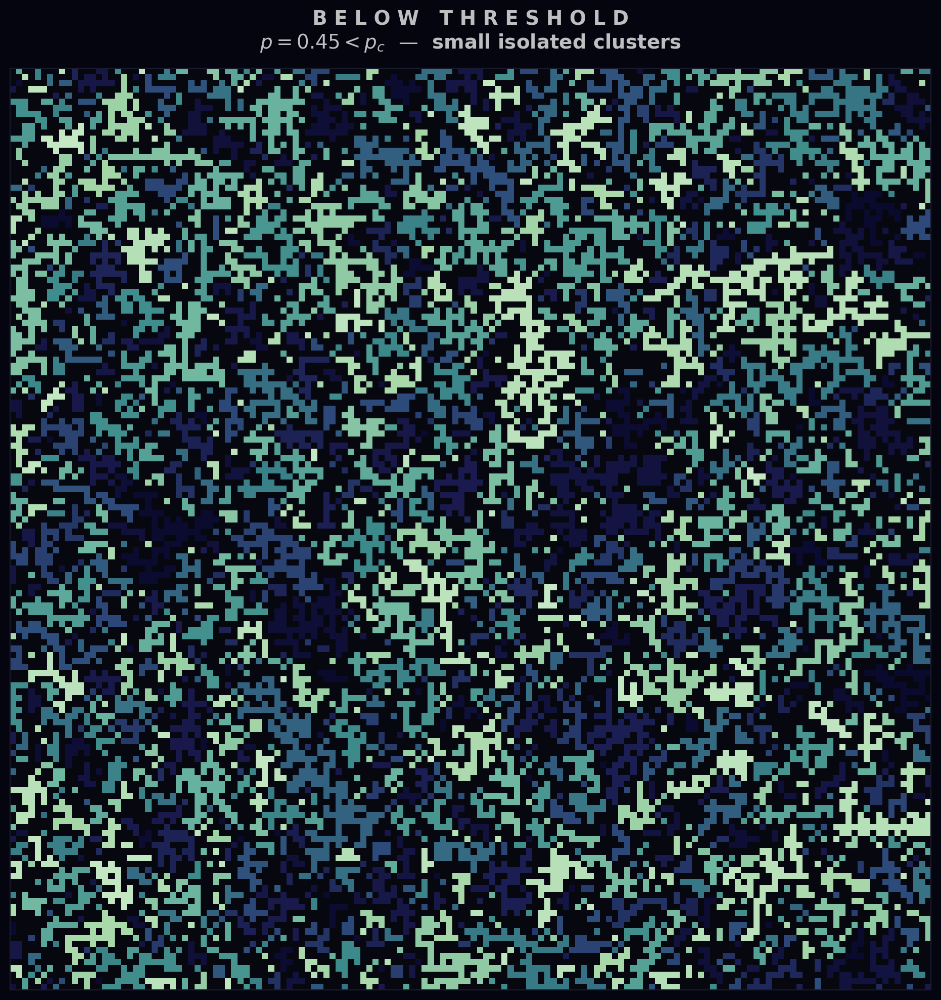
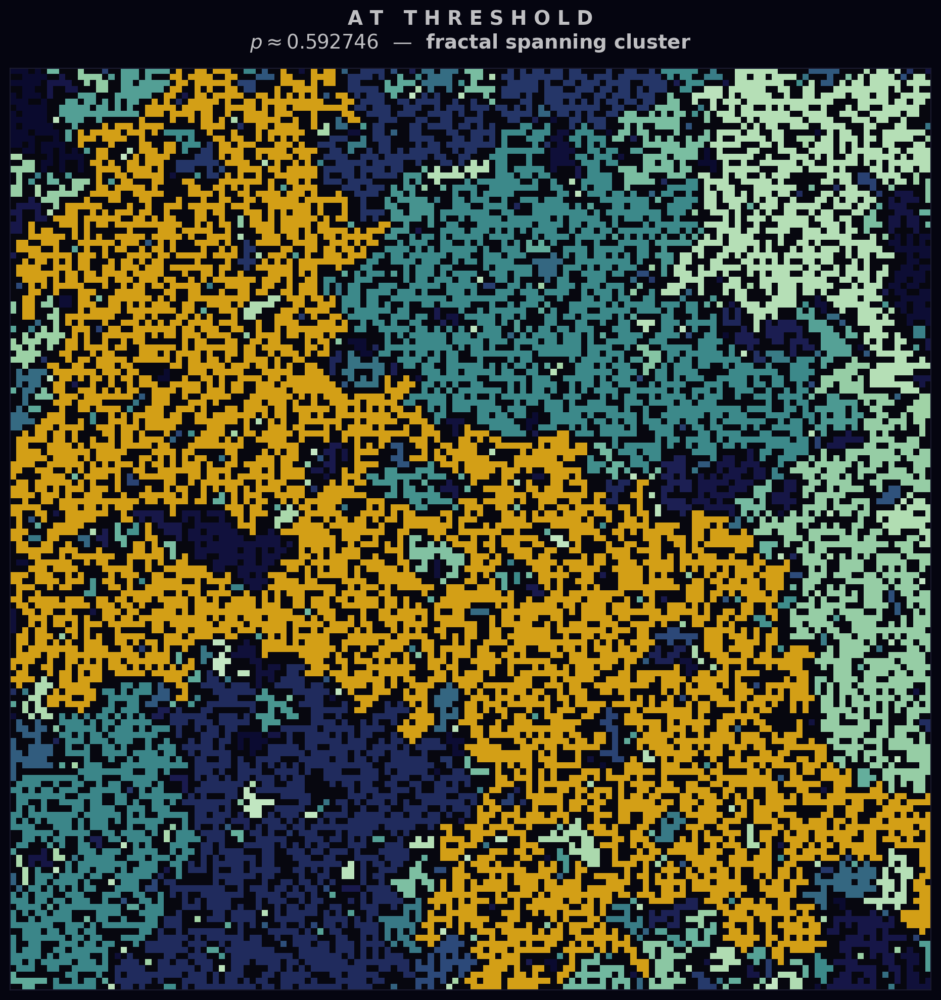
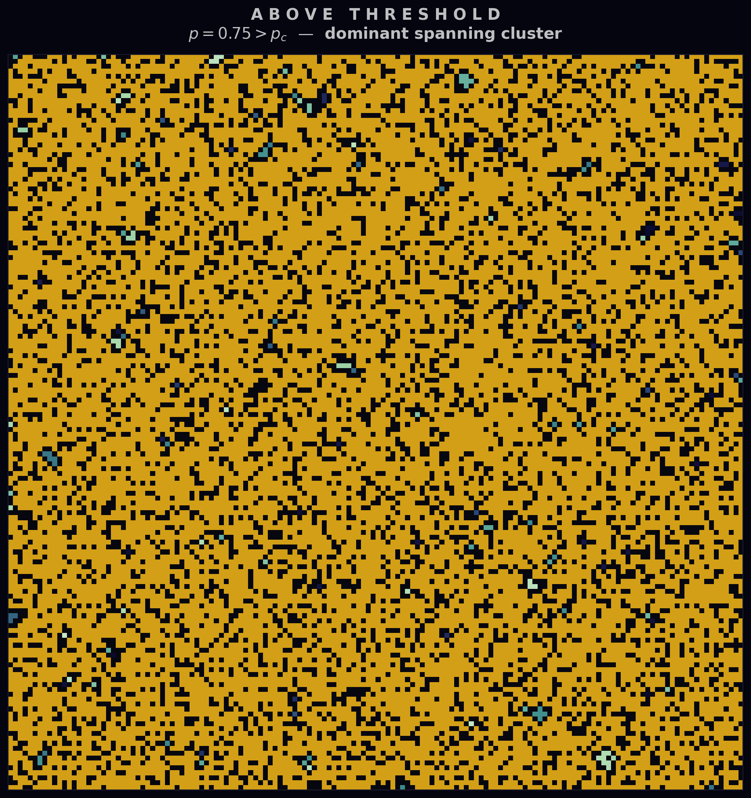
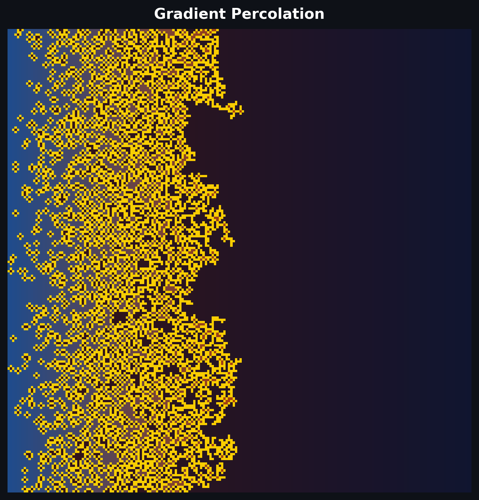
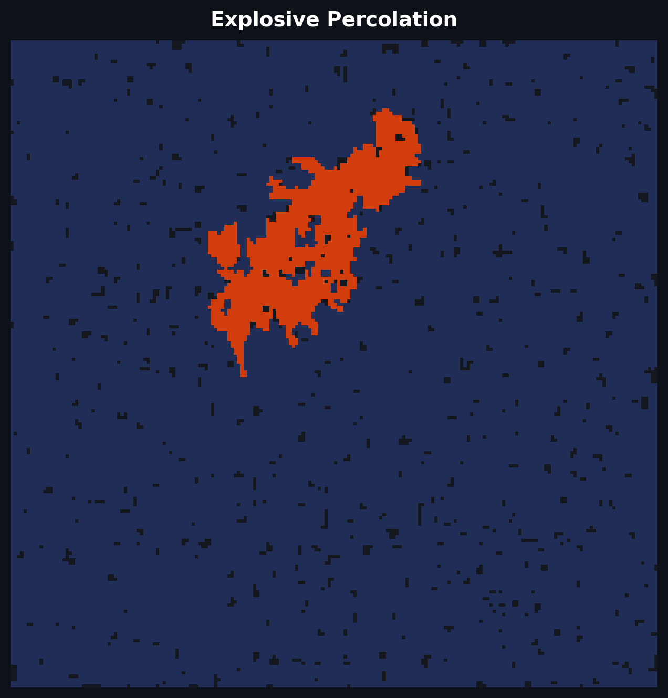
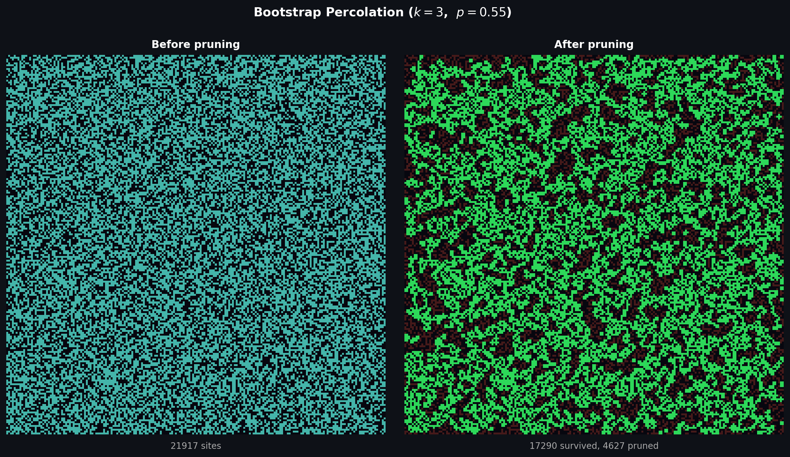
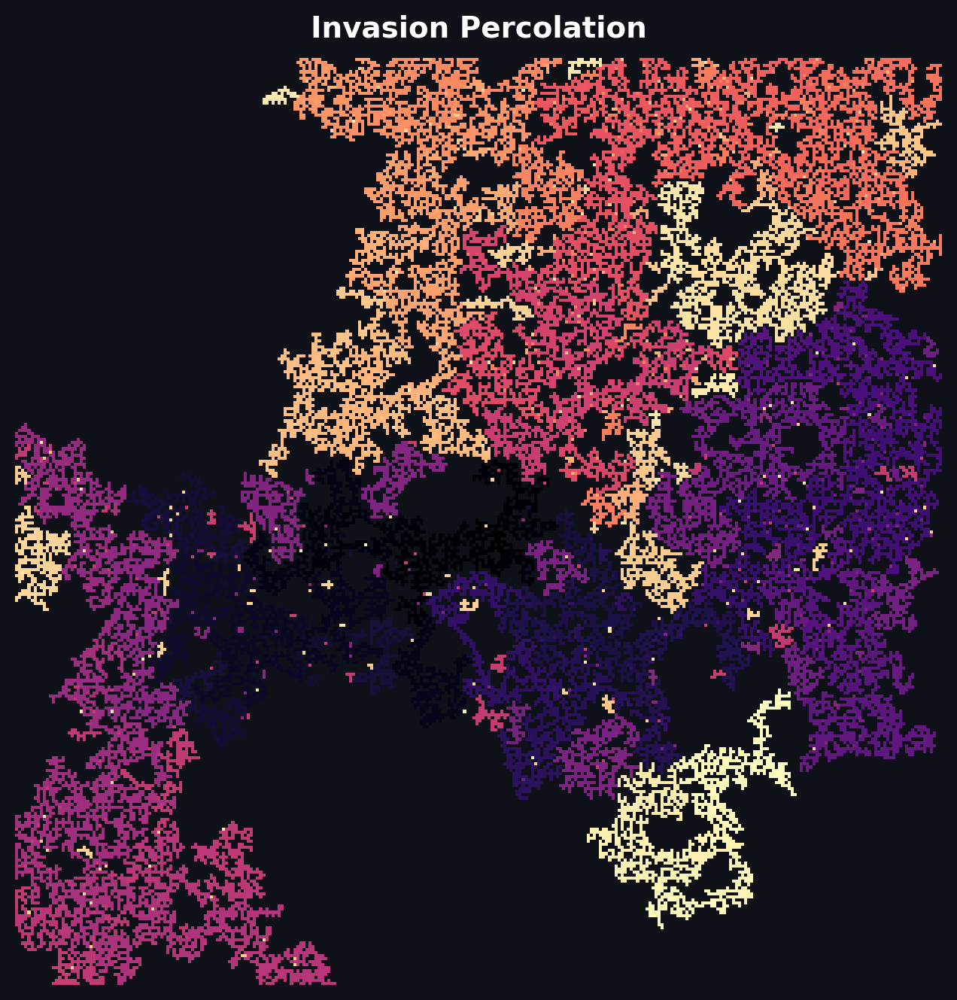
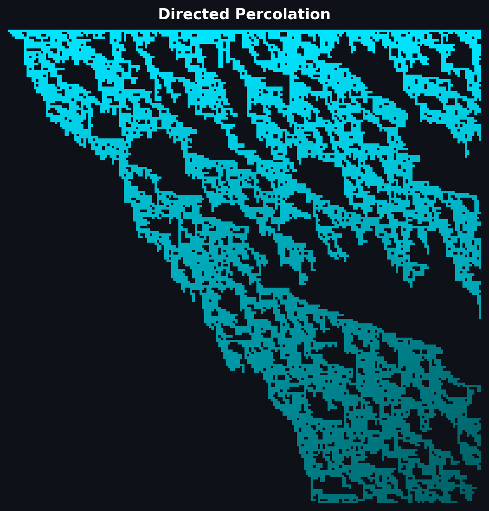
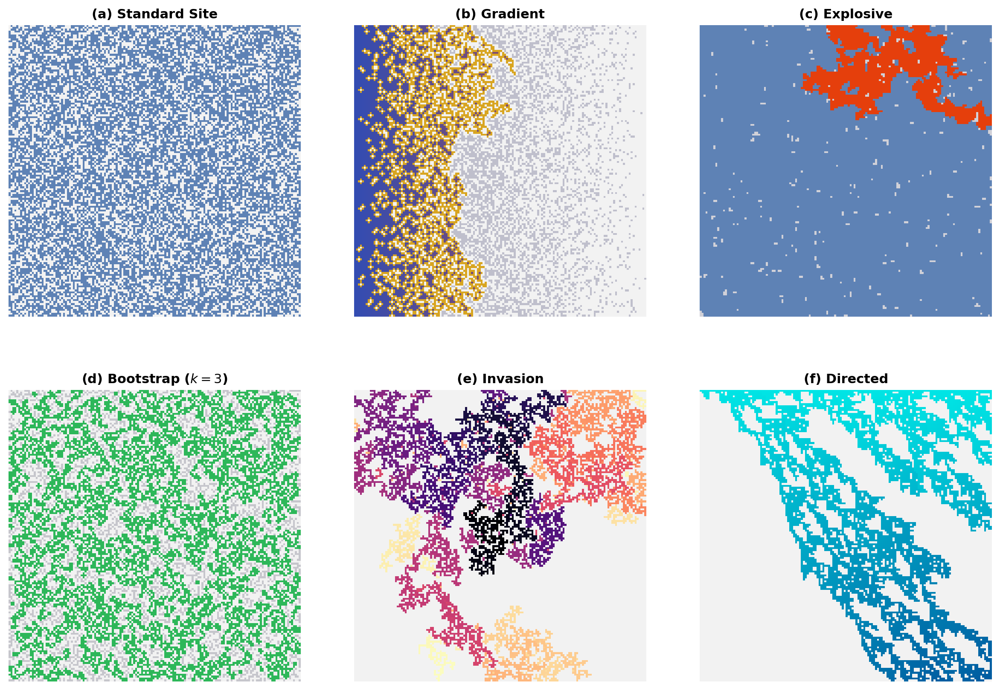

<h1 class="doc-title">Percolation</h1>

<div class="doc-meta"><span>Python script: <code>percolation.py</code></span></div>

Percolation theory studies how connectivity emerges in random systems. Consider a square lattice where each site is independently occupied with probability $p$. At low $p$ the occupied sites form small, isolated clusters. As $p$ increases, clusters grow and merge until — at a sharp critical threshold $p_c$ — a giant cluster first spans the entire system. This geometric phase transition has direct analogues in porous media (fluid flow through rock), forest fires (tree-to-tree spread), epidemic spreading (contact networks), and conductor–insulator composites.

<h3 class="sub-heading" id="perc-site-bond">1. Site vs Bond Percolation</h3>

Two natural variants arise depending on what is randomised:

- **Site percolation** — each *site* (vertex) is independently open with probability $p$. Two open sites are connected if they share a lattice edge. On the square lattice the critical threshold is $p_c^{\text{site}} \approx 0.592\,746$.

- **Bond percolation** — every site is present, but each *bond* (edge) is independently active with probability $p$. Two sites are connected if a path of active bonds joins them. On the square lattice the threshold is exactly $p_c^{\text{bond}} = 1/2$, proven by Kesten (1980).

<table class="cmp-table">
  <tr><th>Type</th><th>What is random</th><th>$p_c$ (square lattice)</th><th>Physical analogue</th></tr>
  <tr><td>Site</td><td>Vertex occupation</td><td>$\approx 0.592\,746$</td><td>Porous rock, random resistor network</td></tr>
  <tr><td>Bond</td><td>Edge activation</td><td>$= 1/2$ (exact)</td><td>Electrical fuse network, gelation</td></tr>
</table>

Despite different thresholds, both models share the same critical exponents — a hallmark of *universality*.

<h3 class="sub-heading" id="perc-union-find">2. Cluster Identification</h3>

Efficient cluster detection is essential for percolation simulations. The *union-find* (disjoint-set) data structure handles this in nearly $O(N)$ time for $N$ sites:

1. Initialise each open site as its own cluster.
2. Scan the lattice; for every pair of adjacent open sites, *union* their clusters.
3. To query whether two sites belong to the same cluster, *find* their roots.

Weighted union (attach the smaller tree under the larger) and path compression (flatten the tree during find) together guarantee amortised $O(\alpha(N))$ operations, where $\alpha$ is the inverse Ackermann function — effectively constant.

```python
class UnionFind:
    def __init__(self, n):
        self.parent = list(range(n))
        self.size   = [1] * n

    def find(self, x):
        root = x
        while self.parent[root] != root:
            root = self.parent[root]
        while self.parent[x] != root:       # path compression
            self.parent[x], x = root, self.parent[x]
        return root

    def union(self, a, b):
        ra, rb = self.find(a), self.find(b)
        if ra == rb: return
        if self.size[ra] < self.size[rb]:   # weighted union
            ra, rb = rb, ra
        self.parent[rb] = ra
        self.size[ra] += self.size[rb]
```

A system *percolates* when a cluster connects the top row to the bottom row. This is checked by comparing the set of root labels on the top row against those on the bottom row.

<h3 class="sub-heading" id="perc-transition">3. The Phase Transition</h3>

The percolation transition is a continuous (second-order) phase transition characterised by two quantities:

**Spanning probability** $\Pi(p)$ — the probability that a spanning cluster exists in a finite $L \times L$ system. For any finite $L$, $\Pi(p)$ is a smooth sigmoid; as $L \to \infty$ it sharpens into a step function at $p_c$.

**Order parameter** $P_\infty(p)$ — the fraction of open sites belonging to the spanning (infinite) cluster. Below $p_c$ no spanning cluster exists, so $P_\infty = 0$. Above $p_c$ the order parameter grows as:

<div class="box formula">

$$P_\infty(p) \sim (p - p_c)^{\beta}, \qquad p \to p_c^+$$

</div>

with $\beta = 5/36$ in two dimensions.

<figure>

<figcaption>
<span class="fig-num">Figure 1.</span>
<strong>Diagnostic overview.</strong> Upper left: spanning probability $\Pi(p)$ for lattice sizes $L = 16, 32, 64, 128$ — the curves steepen and cross near $p_c \approx 0.593$. Upper right: order parameter $P_\infty(p)$ for $L = 64$. Lower left: cluster size distribution at criticality on a log-log scale, with the power-law exponent $\tau = 187/91$. Lower right: finite-size scaling collapse using $\nu = 4/3$. <span class="run-ref">$ python percolation.py</span>
</figcaption>
</figure>

The lattice itself tells the story visually. Below $p_c$ the landscape is a scattering of small, isolated clusters. At $p_c$ a fractal spanning cluster first appears — threading across the system in a tortuous, self-similar path. Above $p_c$ the spanning cluster dominates, absorbing most open sites.

<figure>

<figcaption>
<span class="fig-num">Figure 2.</span>
<strong>Below threshold</strong> ($p = 0.45$). Small, isolated clusters with no spanning path. <span class="run-ref">$ python percolation.py</span>
</figcaption>
</figure>

<figure>

<figcaption>
<span class="fig-num">Figure 3.</span>
<strong>At threshold</strong> ($p \approx 0.593$). A fractal spanning cluster (gold) first connects the top and bottom boundaries. The spanning cluster has a fractal dimension $d_f = 91/48 \approx 1.896$. <span class="run-ref">$ python percolation.py</span>
</figcaption>
</figure>

<figure>

<figcaption>
<span class="fig-num">Figure 4.</span>
<strong>Above threshold</strong> ($p = 0.55$). A dominant spanning cluster (gold) absorbs most open sites. <span class="run-ref">$ python percolation.py</span>
</figcaption>
</figure>

<h3 class="sub-heading" id="perc-exponents">4. Critical Exponents &amp; Universality</h3>

Near $p_c$ the behaviour of every percolation observable is governed by power laws with *universal* critical exponents — quantities that depend only on the spatial dimension $d$, not on the lattice geometry or whether site or bond percolation is used.

<div class="box formula">

$$P_\infty \sim (p - p_c)^{\beta}, \qquad \chi \sim |p - p_c|^{-\gamma}, \qquad \xi \sim |p - p_c|^{-\nu}$$

</div>

<table class="cmp-table">
  <tr><th>Exponent</th><th>Symbol</th><th>Value ($d = 2$)</th><th>Governs</th></tr>
  <tr><td>Order parameter</td><td>$\beta$</td><td>$5/36 \approx 0.139$</td><td>$P_\infty \sim (p - p_c)^\beta$</td></tr>
  <tr><td>Susceptibility</td><td>$\gamma$</td><td>$43/18 \approx 2.389$</td><td>Mean finite cluster size</td></tr>
  <tr><td>Correlation length</td><td>$\nu$</td><td>$4/3 \approx 1.333$</td><td>$\xi \sim |p - p_c|^{-\nu}$</td></tr>
  <tr><td>Fractal dimension</td><td>$d_f$</td><td>$91/48 \approx 1.896$</td><td>Mass of spanning cluster $\sim L^{d_f}$</td></tr>
  <tr><td>Fisher exponent</td><td>$\tau$</td><td>$187/91 \approx 2.055$</td><td>$n_s \sim s^{-\tau}$ at $p_c$</td></tr>
</table>

These exponents are exact in $d = 2$, derived via conformal field theory and Coulomb gas methods. In higher dimensions the values change: for $d \geq 6$ the exponents take their mean-field values ($\beta = 1$, $\gamma = 1$, $\nu = 1/2$).

<h3 class="sub-heading" id="perc-fss">5. Finite-Size Scaling</h3>

On any finite lattice the transition is rounded — there is no true singularity. Finite-size scaling relates observables on an $L \times L$ lattice to the infinite-system behaviour via the scaling ansatz:

<div class="box formula">

$$\Pi(p, L) = \tilde{\Pi}\!\left[(p - p_c)\,L^{1/\nu}\right]$$

</div>

When $\Pi(p)$ is plotted against the rescaled variable $(p - p_c)\,L^{1/\nu}$, data for different $L$ collapse onto a single *universal scaling function* $\tilde{\Pi}$. This collapse (visible in Figure 1, lower right) simultaneously confirms the value of $\nu$ and provides a high-precision estimate of $p_c$.

The same approach applies to the order parameter:

<div class="box formula">

$$P_\infty(p, L) = L^{-\beta/\nu}\,\tilde{P}\!\left[(p - p_c)\,L^{1/\nu}\right]$$

</div>

<h3 class="sub-heading" id="perc-animation">6. The Percolation Transition</h3>

The animation below shows a Newman-Ziff sweep: sites are opened one at a time in a random permutation order on a $100 \times 100$ lattice. Non-spanning clusters appear in cool tones; the spanning cluster, once it forms near $p \approx 0.59$, is highlighted in gold.

<figure>

<figcaption>
<span class="fig-num">Figure 5.</span>
<strong>Percolation transition</strong> — Newman-Ziff sweep from $p = 0$ to $p = 1$ on a $100 \times 100$ lattice. The spanning cluster (gold) emerges near $p_c \approx 0.593$ and rapidly absorbs smaller clusters. <span class="run-ref">$ python percolation.py</span>
</figcaption>
</figure>

<div class="box inprac">
<div class="box-title">In Practice</div>

<strong>Use <code>scipy.ndimage.label</code> for quick cluster labelling</strong> — it is fast and handles arbitrary dimensions, though it does not support the incremental updates needed for Newman-Ziff sweeps. For those, a union-find structure is essential.

The <strong>Newman-Ziff algorithm</strong> is the standard method for efficient Monte Carlo studies: a single random permutation of all $N$ sites gives spanning data at every occupation fraction $p = k/N$ in $O(N\,\alpha(N))$ time, eliminating the need to repeat independent simulations at each $p$.

<strong>3D percolation thresholds</strong> for reference: $p_c^{\text{site}} \approx 0.3116$ (simple cubic), $p_c^{\text{bond}} \approx 0.2488$ (simple cubic). These are not known exactly.
</div>

<h3 class="sub-heading" id="perc-variants">7. Percolation Variants</h3>

The standard site/bond models are only two members of a vast family of percolation processes. Each variant modifies the occupation or connectivity rule, often producing qualitatively different transitions — discontinuous jumps, self-organised criticality, or anisotropic flow. The five variants below are physically motivated and exhibit visually distinct critical behaviour.

<h4 id="perc-gradient">7a. Gradient Percolation</h4>

In gradient percolation the occupation probability varies spatially: $p(x) = 1 - x/L$ decreases linearly from left to right. The spanning cluster's boundary — the *percolation front* — is a fractal curve whose width scales as $L^{7/12}$ (a non-trivial exponent derived from the correlation-length exponent $\nu = 4/3$). Gradient percolation was introduced by Sapoval, Rosso & Gouyet (1985) to model diffusion fronts in porous media, where concentration gradients are the norm rather than the exception.

<figure>

<figcaption>
<span class="fig-num">Figure 6.</span>
<strong>Gradient percolation</strong> ($L = 200$). Occupation probability $p(x)$ decreases left to right; the spanning cluster is coloured by horizontal position and the fractal percolation front is highlighted in gold. <span class="run-ref">$ python percolation_variants.py</span>
</figcaption>
</figure>

<figure>

<figcaption>
<span class="fig-num">Figure 6b.</span>
<strong>Gradient percolation sweep.</strong> A global scale factor increases the occupation probability, revealing how the fractal front migrates across the lattice. <span class="run-ref">$ python percolation_variants.py</span>
</figcaption>
</figure>

<h4 id="perc-explosive">7b. Explosive Percolation</h4>

The Achlioptas process (2009) modifies bond percolation by introducing *competition*: at each step, two candidate bonds are sampled and the one that minimises the product of the merged component sizes is added. This "product rule" systematically delays the formation of a giant component, producing an abrupt-looking transition that was initially claimed to be discontinuous. Riordan & Warnke (2011) later proved the transition is still continuous, but with anomalously sharp finite-size effects — a cautionary tale about inferring phase-transition order from simulations alone.

<figure>

<figcaption>
<span class="fig-num">Figure 7.</span>
<strong>Explosive percolation</strong> ($L = 200$). The giant component (red) emerges via a sudden merger of many medium-sized clusters. Smaller clusters in blue. <span class="run-ref">$ python percolation_variants.py</span>
</figcaption>
</figure>

<figure>

<figcaption>
<span class="fig-num">Figure 7b.</span>
<strong>Explosive percolation transition.</strong> Bonds are added using the Achlioptas product rule. The giant component (red) remains suppressed until a sudden merger event. <span class="run-ref">$ python percolation_variants.py</span>
</figcaption>
</figure>

<h4 id="perc-bootstrap">7c. Bootstrap Percolation</h4>

Bootstrap (or $k$-core) percolation starts with standard site percolation at probability $p$, then iteratively removes any occupied site with fewer than $k$ occupied neighbours. The cascade of removals can be dramatic: even for $p$ well above the standard threshold, the entire lattice may empty out if $k$ is large enough. For $k = 3$ on the square lattice the transition is discontinuous — the surviving $k$-core jumps from zero to a macroscopic fraction at a sharp threshold. This model captures cascading failures in networks, where nodes depend on having a minimum number of functioning neighbours.

<figure>

<figcaption>
<span class="fig-num">Figure 8.</span>
<strong>Bootstrap percolation</strong> ($L = 200$, $k = 3$, $p = 0.55$). Green sites survived the pruning cascade; grey ghost sites were originally occupied but had too few surviving neighbours. <span class="run-ref">$ python percolation_variants.py</span>
</figcaption>
</figure>

<figure>

<figcaption>
<span class="fig-num">Figure 8b.</span>
<strong>Bootstrap pruning cascade.</strong> Sites with fewer than $k = 3$ occupied neighbours are removed round by round. The cascade can strip away most of the lattice. <span class="run-ref">$ python percolation_variants.py</span>
</figcaption>
</figure>

<h4 id="perc-invasion">7d. Invasion Percolation</h4>

Invasion percolation has no tuneable probability parameter. Random weights are assigned to all sites, and a single cluster grows from a seed by always invading the boundary site with the smallest weight. The resulting cluster is *self-organised critical* — it automatically sits at the percolation threshold without any parameter tuning. Introduced by Wilkinson & Willemsen (1983), the model was designed to describe the slow displacement of one fluid by another in a porous medium (e.g., oil recovery), where the invading fluid follows the path of least resistance.

<figure>

<figcaption>
<span class="fig-num">Figure 9.</span>
<strong>Invasion percolation</strong> ($L = 300$). A single cluster grows from the centre; colour (magma palette) encodes the invasion order — warm tones near the seed, cool tones at the growth front. <span class="run-ref">$ python percolation_variants.py</span>
</figcaption>
</figure>

<figure>

<figcaption>
<span class="fig-num">Figure 9b.</span>
<strong>Invasion percolation growth.</strong> The cluster expands from the centre by always invading the lowest-weight boundary site. Colour encodes invasion order (magma palette). <span class="run-ref">$ python percolation_variants.py</span>
</figcaption>
</figure>

<h4 id="perc-directed">7e. Directed Percolation</h4>

Directed percolation restricts bond activation to a preferred direction — here, bonds can only transmit downward or to the right. This breaks the isotropy of standard percolation and places the model in the *directed percolation universality class* (DP), a distinct set of critical exponents ($\beta \approx 0.276$, $\nu_\perp \approx 1.097$, $\nu_\parallel \approx 1.734$ in 2D). DP is conjectured to describe generic absorbing-state phase transitions and appears in models of epidemic spreading (contact process), catalytic reactions, and turbulence onset.

<figure>

<figcaption>
<span class="fig-num">Figure 10.</span>
<strong>Directed percolation</strong> ($L = 200$, $p = 0.645 \approx p_c^{\text{DP}}$). Sites reachable from the top row via down/right bonds, coloured by depth. The anisotropic connectivity produces rivulet-like flow patterns. <span class="run-ref">$ python percolation_variants.py</span>
</figcaption>
</figure>

<figure>

<figcaption>
<span class="fig-num">Figure 10b.</span>
<strong>Directed percolation wavefront.</strong> The BFS wavefront propagates through down/right bonds from the top row, revealing the anisotropic connectivity structure. <span class="run-ref">$ python percolation_variants.py</span>
</figcaption>
</figure>

<table class="cmp-table">
  <tr><th>Variant</th><th>Key feature</th><th>Transition type</th><th>Physical analogue</th></tr>
  <tr><td>Gradient</td><td>Spatially varying $p$</td><td>Continuous front</td><td>Diffusion fronts</td></tr>
  <tr><td>Explosive</td><td>Competitive bond selection</td><td>Abrupt (continuous)</td><td>Network design</td></tr>
  <tr><td>Bootstrap</td><td>$k$-neighbour survival rule</td><td>Discontinuous</td><td>Cascading failures</td></tr>
  <tr><td>Invasion</td><td>Greedy growth, no $p$</td><td>Self-organised critical</td><td>Oil recovery</td></tr>
  <tr><td>Directed</td><td>Anisotropic bonds</td><td>Continuous (DP class)</td><td>Epidemics, catalysis</td></tr>
</table>

<figure>

<figcaption>
<span class="fig-num">Figure 11.</span>
<strong>Variant comparison.</strong> Standard site percolation alongside five exotic variants, each at or near its critical point. <span class="run-ref">$ python percolation_variants.py</span>
</figcaption>
</figure>
